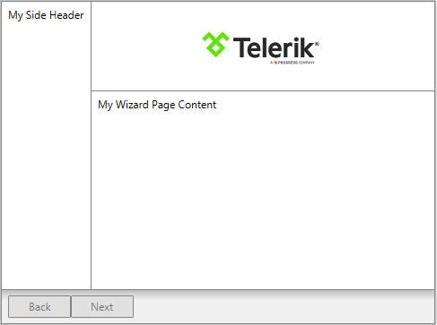

# Wizard Pages

In order to add pages to RadWizard you have to use its __WizardPages__ collection. It can consists of the following page types:
* WizardPage - represents a wizard's page and by default its __ButtonsVisibilityMode property is set to “Previous”, ”Next” and “Cancel”__.
* WelcomeWizardPage – represents a welcome page. It derives directly from __WizardPage__ and the only difference is that the __ButtonsVisibilityMode property is set to “Next” and “Cancel”__ by default. 
* CompletionWizardPage - represents a completion page. It derives directly from __WizardPage__ and the only difference is that the __ButtonsVisibilityMode property is set to “Previous”, “Cancel” and “Finish”__ by default. 
For each wizard page you are able to define a header, title, side header and change the default footer by setting the following properties:
* Header – enables you to define anything as a header.
* Title – provides a way to define a title for the page.
* SideHeader – enables you to define anything as a side header on the left side of the page. 
* Content – contains the page content (WizardPage derives directly from ContentControl). 

Setting __HeaderTemplate, SideHeaderTemplate and FooterTemplate__ - All these properties can be used to get or set the data template respectfully for the __header, side header and footer__. So, if you want to change those default elements for a particular wizard page, you may define them as follows:

#### __XAML__
	<telerik:RadWizard x:Name="radWizard" >
		<telerik:RadWizard.WizardPages>
			<telerik:WizardPage Content="My Wizard Page Content" SideHeaderWidth="100" HeaderHeight="100">					
				<telerik:WizardPage.HeaderTemplate>
					<DataTemplate>
						<Image Source="Images/BrandMark_Telerik_Black.png" Width="200" Height="100" />
					</DataTemplate>
				</telerik:WizardPage.HeaderTemplate>
				<telerik:WizardPage.SideHeaderTemplate>
					<DataTemplate>
						<TextBlock Text="My Side Header" />
					</DataTemplate>
				</telerik:WizardPage.SideHeaderTemplate>
				<telerik:WizardPage.FooterTemplate>
					<DataTemplate>
						<StackPanel Orientation="Horizontal">
							<telerik:RadButton Content="Back" 
												   Width="70" Height="25"
												   Command="wizard:RadWizardCommands.MoveCurrentToPrevious"  
												   CommandParameter="{Binding}" />
							<telerik:RadButton Content="Next" Width="70" Height="25"
												   Command="wizard:RadWizardCommands.MoveCurrentToNext" 
												   CommandParameter="{Binding}" />
						</StackPanel>
					</DataTemplate>
				</telerik:WizardPage.FooterTemplate>
			</telerik:WizardPage>				
		</telerik:RadWizard.WizardPages>			
	</telerik:RadWizard>

>noteIn order to use the built-in commands you should define the following namespace:
__xmlns:wizard="clr-namespace:Telerik.Windows.Controls.Wizard;assembly=Telerik.Windows.Controls.Navigation"__

__Figure 1:__ The wizard page defined above will be displayed as follows:

