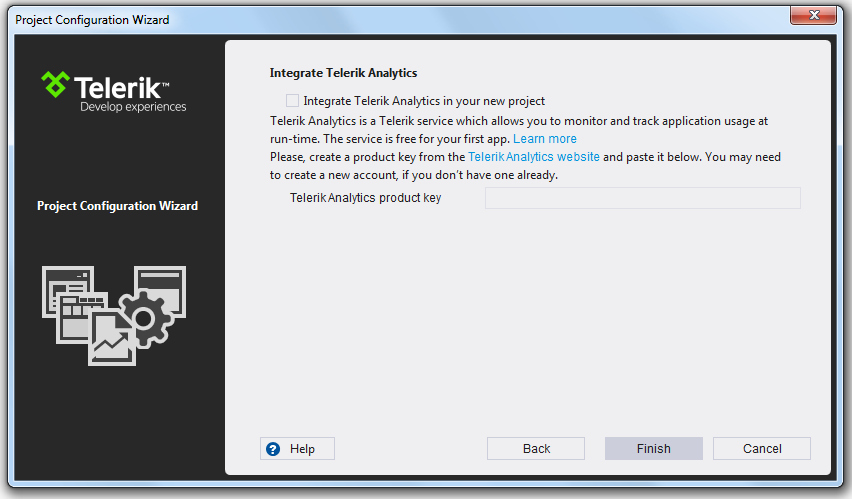
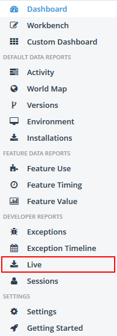
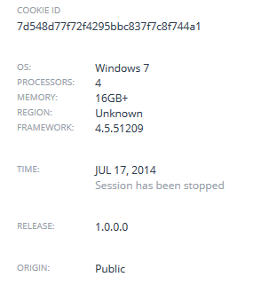
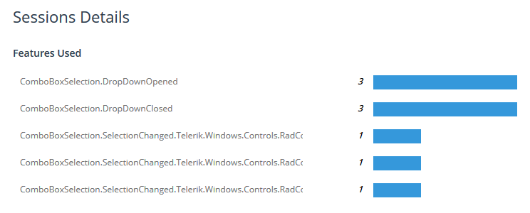

# Telerik Analytics Integration

When you are creating an application for a broad audience, integrating some kind of analytics framework is crucial, because you will need to analyze the usage data of the application and its features and most probably you will need to know about any application crashes or other errors occurred during the execution. With Q3 2013 release UI for WPFSilverlight provides integrated support for [Telerik Analytics](http://www.telerik.com/analytics). Using Analytics you will be able to trace certain features of the controls and get statistics about their usage.
      
In order to use the service you should contact sales@telerik.com and they will help you get your product key. For more information please check out the [Introduction to Telerik Analytics](http://docs.telerik.com/platform/analytics/getting-started/introduction) topic.
      

Then you can create a new Telerik Silverlight Application with enabled Analytics support or you can enable it in an existing project. 
      
Both options are explained in details below.
      
## How to create a new project supporting Analytics
     
Using the [Telerik Visual Extensions]() you can quickly create an application configured to use UI for Silverlight.
        
After including the needed Telerik assemblies and setting a theme in the __New Project Wizard__, you will reach the following configuration screen:

Enable the option for  __Analytics support__ and __Finish__ the setup.        

>Please make sure that you have specified the correct key you got after registering your application on [https://platform.telerik.com/](https://platform.telerik.com/).
          
The wizard references two additional Telerik assemblies ( __EQATEC.Analytics.Monitor.dll__ and __Telerik.Windows.Analytics.dll__ ) and initializes the __Telerik.Windows.Analytics.TraceMonitor__ used to track the controls features usage in the App.xaml.cs file, the generated code will look like this:
        
#### __C#__

{{region eqatec-analytics-application-integration_0}}
	public App()
	{         
	    //The following code enables Telerik Analytics for your project
	    var analyticsMonitor = Telerik.Windows.Analytics.TraceMonitor.Initialize(this, [product_key]);
	    //Next Step: Enable analytics tracking for the Telerik controls that make sense to your business case. For example here is XAML code to enable tracking when a RadButton that downloads a file is clicked:
	    //xmlns:telerik="http://schemas.telerik.com/2008/xaml/presentation" 
	    //<telerik:RadButton Content="Click me" Height="50" telerik:Analytics.Name="DownloadButton" />
	    //For more information go to: http://www.telerik.com/help/wpf/eqatec-analytics-application-integration.html
	}
{{endregion}}

where [product_key] will be replaced with the entered in the __New Project Wizard__ value.

>tipThe code related to Telerik Analytics is commented when a new project is created without enabling the Analytics option.

    
## How to add support to existing applications
      
First, you will need to reference the __EQATEC.Analytics.Monitor.dll__ and __Telerik.Windows.Analytics.dll__ in your application. Note that these dlls are distributed together with the other assemblies in the UI for WPFSilverlight suite.        
      
Then in order to configure the project to support Analytics, please add the the following code in the constructor of the App class:        

#### __C#__

{{region eqatec-analytics-application-integration_1}}
	public App()
	{           
	     var analyticsMonitor = Telerik.Windows.Analytics.TraceMonitor.Initialize(this, [product_key]);
	}
{{endregion}}

where [product_key] should be replaced with the __product key__ you got after registering your application on [https://platform.telerik.com/](https://platform.telerik.com/)

## How Analytics works
      
This section demonstrates how Analytics work with Telerik controls. Let’s, for example, create a test application registered as AnalyticsTestApp in the [Telerik Platform](https://platform.telerik.com/). Add a few controls that support Analytics to it:
        

#### __XAML__

{{region eqatec-analytics-application-integration_1}}
	<StackPanel Orientation="Horizontal"> 
	    <telerik:RadComboBox Width="200"> 
	        <telerik:RadComboBoxItem Content="Silverlight" /> 
	        <telerik:RadComboBoxItem Content="WPF" /> 
	        <telerik:RadComboBoxItem Content="ASP.NET AJAX" /> 
	        <telerik:RadComboBoxItem Content="WinForms" /> 
	    </telerik:RadComboBox> 
	    <telerik:RadButton Content="Select" Click="Select_Click" /> 
	</StackPanel> 
{{endregion}}

All that is needed is to set the __telerik:Analytics.Name__ attached property to the used in the example RadComboBox and RadButton. Note that the set values will then be used in the __dashboard__.
        
Here is the updated code:        

#### __XAML__

{{region eqatec-analytics-application-integration_2}}
	<StackPanel Orientation="Horizontal"> 
	    <telerik:RadComboBox Width="200" telerik:Analytics.Name="ComboBoxSelection"> 
	        <telerik:RadComboBoxItem Content="Silverlight" /> 
	        <telerik:RadComboBoxItem Content="WPF" /> 
	        <telerik:RadComboBoxItem Content="ASP.NET AJAX" /> 
	        <telerik:RadComboBoxItem Content="WinForms" /> 
	    </telerik:RadComboBox> 
	    <telerik:RadButton telerik:Analytics.Name="SelectButton" Content="Select" Click="Select_Click" /> 
	</StackPanel>
{{endregion}}

To trace the features please follow the next steps:

* Run the project with the provided code
       
* Select an item from the ComboBox and click the Button
            
* Close the application.
            
* Go to the Analytics Project Dashboard
         
*  Select the __Live__ link:

The next screen will list the live usage sessions:

Clicking on the __Session__ link will show additional details about the session including the exact features used:

If you go to the __Feature Use link__ in the Dashboard panel, you will find information and statistics for the registered features for different periods of time:

## Traceable features in UI for WPFSilverlight

Currently only few controls support analytics out of the box. Note that only user interactions will be tracked - initial values and values from Bindings are not supported.

You can find below a list of the controls and their features that support tracing:
        
Feature	|	Feature Name
---	|	---
__RadBusyIndicator__	|	
Show	|	ShowIndicator
__RadComboBox__	|	
SelectionChanged	|	SelectionChanged
DropDownOpened	|	DropDownOpened
DropDownClosed	|	DropDownClosed	
__RadContextMenu__	|	
Open	|	Opened
Close	|	Closed
Click	|	Click
__RadDropDownButton__|	
DropDownOpened	|	DropDownOpened
DropDownClosed	|	DropDownClosed
__RadExpander__ |	
Expanded	|	Expanded
Collapsed	|	Collapsed
__RadGridView__	|	
Sort	|	Sorted
Group	|	Grouped
Filter	|	Filtered
__RadMenu__	|	
Click	|	Click
__RadRadioButton__ |	
Checked	|	Checked
UnChecked	|	UnChecked	
__RadRichTextBox__	|	
Open Document	|	Open Document
Save Document	|	Save Document
Print	|	Print
__RadSpreadsheet__ |	
Open Document	|	Open Document
Save Document	|	Save Document
Load Image	|	LoadImage
Save Image	|	SaveImage	
__RadToggleButton__	|	
Checked	|	Checked
UnChecked	|	UnChecked
__RadTreeListView__	|	
Sort	|	Sorted
Group	|	Grouped
Filter	|	Filtered
