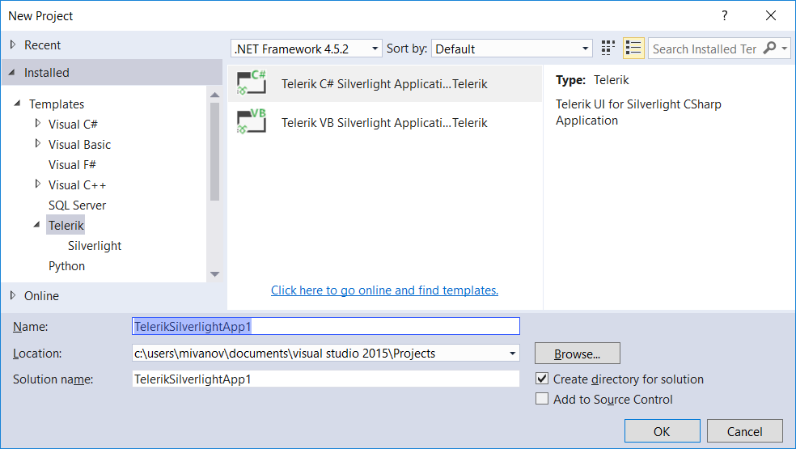
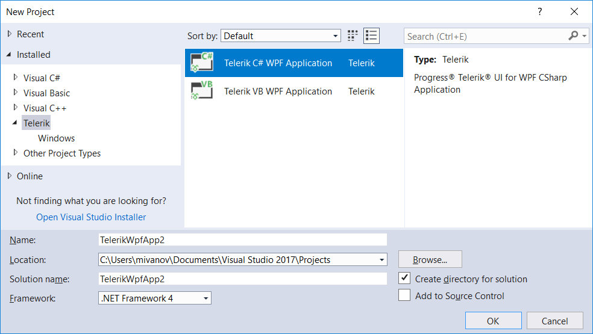
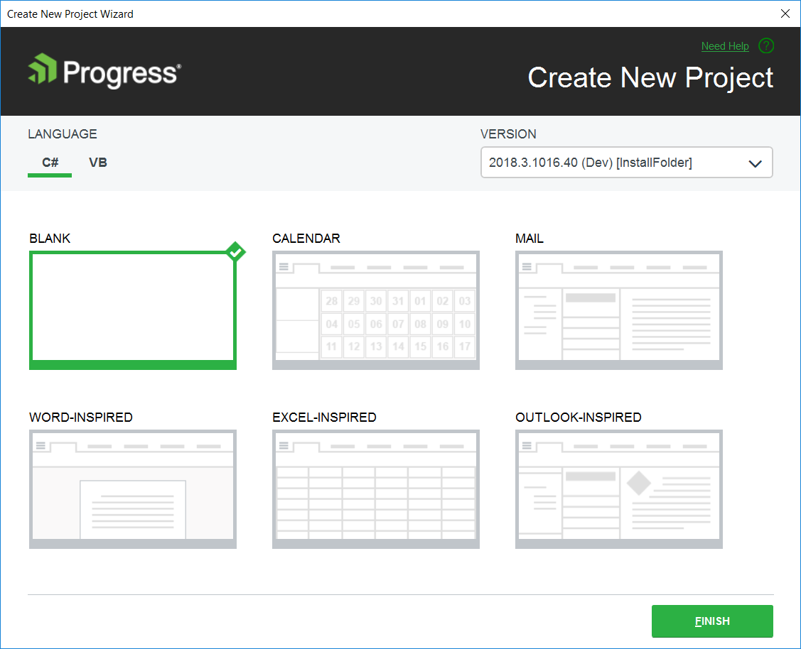

# Creating an Application and Adding Telerik Controls

The following topic describes what steps you should perform in order to add the Telerik UI for {{ site.platform_name }} in your application. There are two ways to do this - first one is to install Telerik Extensions for VisualStudio. The second one is by adding the necessary assemblies as references in your application manually. No matter which of the two manners you will choose, you will be able to use the Toolbox to create your application.

## Creating Application with Telerik Visual Studio Extensions

1. Open [Microsoft Visual Studio]()().

2. Create new Telerik {{ site.platform_name }} application.
	
	#### __Figure 1: Creating new Telerik application__	
	
	
	
	

	>You can choose __.Net Framework 4.0__ or __.Net Framework 4.5__ for your application.
	

3. Choose the application template. The options are a blank template or one of the MS Office inspired application templates. Choose the Blank option.
	
	#### __Figure 2: Choosing an application template__
	

	At this point the project references only the common Telerik.Windows.Controls.dll. 

4. Configure the project using the Project Configuration Wizard. This will add the dlls required by the controls you want to use. When you open the wizard you can select the  control you are going to use from the list (or search them in the search box). Clicking okay will add all required references for the controls.

	#### __Figure 3: Adding references to the charting controls__
		

	> This step is optional and you will need it only if use controls that are not defined in Telerik.Windows.Controls.dll.

## Creating Application and Manually Referencing the Telerik Assemblies

1. Open [Microsoft Visual Studio]()().
          	
2. Create a new {{ site.platform_name }} application.
	
	#### __Figure 4: Creating new {{ site.platform_name }} application__
	

3. Add references to the Telerik assemblies. There are two options to do this.
	
	* [Drag a Telerik control from the toolbox](#dragging-controls-from-visual-studio-toolbox). When the control gets dropped onto the Visual Studio designer's surface, Visual Studio will automatically add the corresponding references.
	
	* Manually reference the Telerik dlls from the UI for {{ site.platform_name }} installation folder.	The binaries are located in the *UI for {{ site.platform_name }} installation folder/Binaries/WPF40/*
	
### Dragging Controls from Visual Studio Toolbox

* Add the Telerik {{ site.platform_name }} controls to the [Visual Studio Toolbox]().

	>tip If you wonder which control in which assembly belongs to, read the main topic about [Controls Dependencies]()[Controls Dependencies]().

* Open MainWindow.xamlMainPage.xaml of the project you have previously created (in the [Creating Application and Manually Referencing the Telerik Assemblies](#creating-application-and-manually-referencing-the-telerik-assemblies) section).

* Select any Telerik control in the Visual Studio Toolbox.

* Drag and drop the control in the Visual Studio XAML designer. 

	
	#### __[XAML] Example 1: RadButton XAML automatically generated by dropping the control onto the Visual Studio designer__
	{{region installation-adding-to-application-create-application-and-adding-control-0}}
		<Window x:Class="WpfApplication1.Window1"
			xmlns="http://schemas.microsoft.com/winfx/2006/xaml/presentation"
			xmlns:x="http://schemas.microsoft.com/winfx/2006/xaml"
			xmlns:telerik="http://schemas.telerik.com/2008/xaml/presentation"
			Title="Window1" Height="300" Width="300">
			<Grid>
				<telerik:RadButton></telerik:RadButton>
			</Grid>
		</Window>
	{{endregion}}
	
	#### __[XAML] Example 1: RadButton XAML automatically generated by dropping the control onto the Visual Studio designer__
	{{region installation-adding-to-application-create-application-and-adding-control-1}}
		<UserControl 
			x:Class="Test.MainPage"
			xmlns="http://schemas.microsoft.com/winfx/2006/xaml/presentation" 
			xmlns:x="http://schemas.microsoft.com/winfx/2006/xaml"
			xmlns:d="http://schemas.microsoft.com/expression/blend/2008" 
			xmlns:mc="http://schemas.openxmlformats.org/markup-compatibility/2006"
			xmlns:telerik="http://schemas.telerik.com/2008/xaml/presentation"    
			mc:Ignorable="d" d:DesignWidth="640" d:DesignHeight="480">
		  <Grid x:Name="LayoutRoot">
				<telerik:RadTreeView></telerik:RadTreeView>
		  </Grid>
		</UserControl>
	{{endregion}}
	

> After dropping a control, Visual Studio automatically creates a namespace that points to the appropriate assembly. If you want to manually set up a namespace take a look at the [Namespace Declaration]() topic.

## See Also  
 * [Namespace Declaration]()
 * [Xaml vs NoXaml]()
 * [Using IntelliSense in Visual Studio]()
 
 * [Upgrading Telerik UI Trial to Telerik UI Developer License or Newer Version]() 
 
 * [Upgrading Telerik UI Trial to Telerik UI Developer License or Newer Version]() 
 
