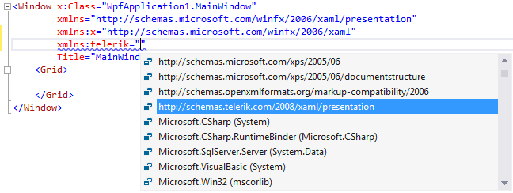
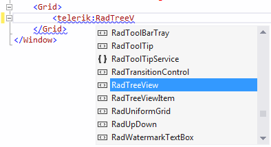
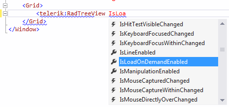

# Using IntelliSense in Visual Studio

Visual Studio automatically enables [IntelliSense](http://en.wikipedia.org/wiki/IntelliSense) - it detects all classes, properties and methods in the __DLL__ file.

## Using IntelliSense when Declaring Namespace

When declaring a namespace you can select from the IntelliSense in XAML any namespace which is available:

For more information about declaring namespaces read [here]().

## Using IntelliSense when Adding/Configuring Controls in XAML

When you add a new control (or configure an existing one) in the XAML, Visual Studio will automatically show a dropdown with suggestions for autocomplete. For example, see the next two figures.

## Using IntelliSense in the Code-Behind

In the code-behind, each time a particular class/property/method is being selected from the dropdown of the autocomplete functionality, a tooltip with the comment for this class/property/method is displayed.

# See Also

 * [Upgrading Telerik UI Trial to Telerik UI Developer License or Newer Version]()

 * [Controls Dependencies]()
