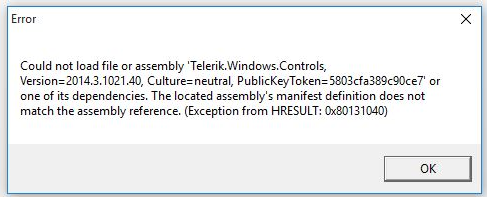

# Installing WPF Demos application

__Telerik WPF Demos application__ provides a bunch of examples showcasing all the important features of Telerik UI for WPF controls.

In this topic we will go through the following sections:

* [How to run WPF Demos application](#how-to-run-wpf-demos-application)

* [How to get the solution](#how-to-get-the-solution)

* [Common issues](#common-issues)

## How to run WPF Demos application

WPF Demos application could be accessed from the following link: [http://demos.telerik.com/wpf/](http://demos.telerik.com/wpf/)

As it is deployed as a ClickOnce application it requires the following components in order to be installed and run locally:

* Windows Installer 3.1

* Windows Installer 4.5 

* Microsoft .NET Framework 4 Client Profile (x86 and x64) 

* SQL Server 2008 SP3 Express or newer **(not required with R3 2017 SP1 and later)**

If these components are already installed, you can [launch](http://demos.telerik.com/wpf/WPF%20Demos.application) the application. 

Otherwise, you will need to [install](demos.telerik.com/wpf/setup.exe) the prerequisites before running the application. As a result the demos will be deployed on your computer and you will be able to run them locally.

>If you have a previous installation of WPF Demos, make sure to uninstall it before installing a newer version.

## How to get the solution

The solution containing the source code of the examples is available in the Telerik UI for WPF download page inside your Telerik account. Go to the next steps in order to download it:

* Log in at [www.telerik.com](http://www.telerik.com/account.aspx).

* Click Products & Subscriptions tab and then select Telerik UI for WPF from the dropdown (or Trials if you have a trial license).

>If you've purchased Telerik DevCraft Complete/Ultimate bundle, you will see it in the Products & Subscriptions dropdown.

* Click "Download Installer and other resources" button. 

>Again, if you've purchased Telerik DevCraft Complete/Ultimate bundle, you will be redirected to a page with all the products in the suite. Locate "Telerik UI for WPF" product and follow "Browse all product files" to go to the detailed download page.

* Under the Resources section, you should see the archive file containing the source code of the examples. Its name is __Telerik_UI_for_WPF_[version]_Demos.zip__.

>tipThe zip does not contain the assemblies so that it's smaller in size. Building and running the Demos solution locally requires to have a local installation of Telerik UI for WPF suite with the same version. 

## Common issues

In this section we will review the most common issues experiencing when running the WPF Demos application.

* Receiving an exception as in __Figure 1__.

__Figure 1: Exception when trying to install WPF Demos__

Issues like this are caused by some files left from previous installations. As the WPF Demos is a ClickOnce application, we generally recommend fully uninstalling it before installing a newer version. Sometimes you might also need to manually delete the folders, if there are such left, after uninstalling the application and clear the application cache. By default the files of the application are stored under the following directory: 
<drive>:\Users\<your_user>\AppData\Local\Apps\2.0

* SQL version mismatch **(not relevant with R3 2017 SP1 and later)**

If you receive an error about the SQL version, for example:

_Prerequisite check for system component SQL Server 2008 Express failed with the following error message:
"SQL Server 2008 Express Service Pack 1 (x64) cannot upgrade the existing instance of SQL Server 2005 Express (x64 WoW) named 'SQLEXPRESS'. Uninstall this instance of SQL Server 2005 Express and retry installing SQL Server 2008 Express Service Pack 1 (x64)."_

You should either uninstall the older SQL Server or change the instances names, so that the default “SQLEXPRESS” refers to the SQL Server 2008 Express.

## See Also

 * [Installing Telerik UI for WPF from MSI File]()

 * [Installing Telerik UI for WPF from ZIP File]()

 * [Using the Hotfix (DLLs Only)]()
