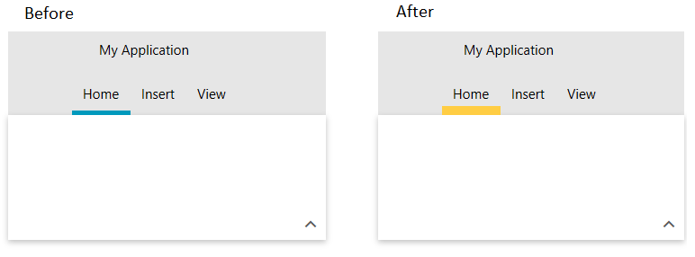

## Environment
<table>
	<tr>
		<td>Product Version</td>
		<td>2019.1.116</td>
	</tr>
	<tr>
		<td>Product</td>
		<td>RadRibbonView for WPF</td>
	</tr>
</table>

## Description

By default the selected RadRibbonTab control has a 4 pixels high blue-colored border. The following example shows how to customize this without extracting the ControlTemplate of RadRibbonTab.

## Solution

To customize the RadRibbonTab in code follow the next few steps:

1. Subscribe to the Loaded event of RadRibbonTab.
2. Call the [ChildrenOfType<T>()]() method with the loaded RadRibbonTab control to get all Border elements. 
3. Call the FirstOrDefault() Linq method to find the Border with x:Name="SelectedVisual". This is the element presenting the border around the selected tab.
4. Set the BorderBrush and BorderThicknes properties of the Border control.

#### [XAML] Subscribing to the Loaded event
{{region kb-ribbonview-customize-tab-bottom-border-fluent-theme-0}}
	<telerik:RadRibbonView>
		<telerik:RadRibbonTab Header="Home" Loaded="RadRibbonTab_Loaded" />
		<telerik:RadRibbonTab Header="Insert" Loaded="RadRibbonTab_Loaded" />
		<telerik:RadRibbonTab Header="View" Loaded="RadRibbonTab_Loaded" />            
	</telerik:RadRibbonView>
{{endregion}}

#### [C#] Customizing the border in code
{{region kb-ribbonview-customize-tab-bottom-border-fluent-theme-1}}
	private void RadRibbonTab_Loaded(object sender, RoutedEventArgs e)
	{
		var tab = (RadRibbonTab)sender;
		var border = tab.ChildrenOfType<Border>().FirstOrDefault(x => x.Name == "SelectedVisual");
		if (border != null)
		{
			border.BorderBrush = new SolidColorBrush((Color)ColorConverter.ConvertFromString("#FFCD43"));
			border.BorderThickness = new Thickness(0, 0, 0, 8);
		}
	}
{{endregion}}

#### Before (left) and after (right) visual example

## See Also
* [Visual Tree Helpers]()
* [RibbonView Getting Started]()

