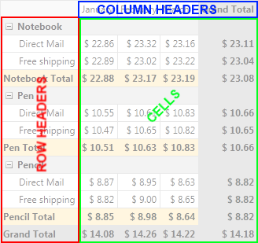

# ToolTips

__RadPivotGrid__ shows ToolTips when you place your mouse over the cells. The ToolTip has default content, but you can set your own or disable it.
        In this article we will show you how you can do this.
      

## Default ToolTip

If you run your application and mouse over any of the cells in __RadPivotGrid__ you will see the default ToolTip that is constructed from the information
        in the DataProvider:
        

As you can see the ToolTip shows the aggregate function that is used and on which property it is set. Also you can see the information in which row and column is the cell.
        

__RadPivotGrid__ shows different ToolTips based on the position of the mouse. There are three common positions - RowHeader, ColumnHeader or Cell.
          The default ToolTip defers a little bit for these three positions. In the image below you can check the three areas of the different ToolTips.
        

If you put your mouse over the red zone (Row Headers) the ToolTip which have the following content: row header, group description from which it was created and under Row: the hierarchy in the RowGroupDescriptions
          collection where this item stands. The ToolTip for Column Headers (blue zone on image above) is almost the same, but you will Column instead of Row. Cell's ToolTip (green zone) will show the
          aggregate function that is used and on which property it is set. Also you can see the information in which row and column is the cell.
        

## Custom ToolTips

You can set your own ToolTips for the three mentioned areas by using the following properties of __RadPivotGrid__:
        

* __RowGroupTooltipStyle__ - sets the style of the ToolTip that will show for RowHeaders.
            

* __ColumnGroupTooltipStyle__ - sets the style of the ToolTip that will show for ColumnHeaders.
            

* __CellTooltipStyle__ - sets the style of the ToolTip that will show for Cells.
            

You can show three different ToolTips for the three different styles.
        

#### __XAML__

{{region radpivotgrid-features-tooltips_1}}
	<Window.Resources>
	    
	
	    
	    
	    
	</Window.Resources>
	
	<Grid>
	    <pivot:RadPivotGrid Name="radPivotGrid1"
	                        RowGroupTooltipStyle="{StaticResource RowToolTip}"
	                        CellTooltipStyle="{StaticResource CellToolTip}"
	                        ColumnGroupTooltipStyle="{StaticResource ColumnToolTip}">
	</Grid>
	{{endregion}}



#### __XAML__

{{region radpivotgrid-features-tooltips_2}}
	<UserControl.Resources>
	    
	
	    
	    
	    
	</UserControl.Resources>
	
	<Grid x:Name="LayoutRoot">
	    <pivot:RadPivotGrid Name="radPivotGrid1"
	                        RowGroupTooltipStyle="{StaticResource RowToolTip}"
	                        CellTooltipStyle="{StaticResource CellToolTip}"
	                        ColumnGroupTooltipStyle="{StaticResource ColumnToolTip}">
	</Grid>
	{{endregion}}



>If you want to use the value of the cell in the ToolTip you should set Binding to Data property. To use the DisplayName of the cell you should set Binding to AggregateDescription.DisplayName.
            For RowGroupToolTipStyle and ColumnGroupTooltipStyle you should set Binding to GroupDescription.DisplayName property.
          

## Disable ToolTips

You can disable the ToolTips for each of the three groups at any time by using the properties:
        

* __RowToolTipIsEnabled__ - if it is set to false the ToolTip on RowHeaders will not show up.
            

* __ColumnToolTipIsEnabled__ - if it is set to false the ToolTip on ColumnHeaders will not show up.
            

* __CellToolTipIsEnabled__ - if it is set to false the ToolTip on Cells will not show up.
            
