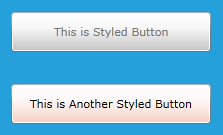

# Windows8 and Windows8Touch Colors and Fonts

This article will show you how to easily modify __Windows8__ and __Windows8Touch__ themes and how to change the font of your application at runtime.
      

## Colorizing the Windows8 and Windows8Touch Themes

When Telerik developed the *Windows8* theme, we needed as little as 6 brushes for our controls. Exceptions are the Charts, ScheduleView, etc., which use some additional colors for their chart series, time markers and categories.
        

All Telerik controls use brushes that are linked to one major singleton object that contains the colors to be used for the __Windows8__ / __Windows8Touch__ themes. They are public so you can easily modify the colors of the theme at one single point.
       

You can change the __Windows8__ / __Windows8Touch__ colors by setting properties as shown in __Example 1__.
        

__Example 1__: You can change colors in the Windows8 and Windows8Touch themes by setting the properties of the Palette object.
        

#### __C#__

{{region common-styles-appearance-colorizing-metro-theme_0}}
	Windows8Palette.Palette.MainColor = Colors.Black;
	Windows8Palette.Palette.AccentColor = Colors.Orange;
	Windows8Palette.Palette.BasicColor = Colors.DarkGray;
	Windows8Palette.Palette.StrongColor = Colors.Gray;
	Windows8Palette.Palette.MarkerColor = Colors.LightGray;
	Windows8Palette.Palette.ValidationColor = Colors.Red;
	...
	
	Windows8TouchPalette.Palette.MainColor = Colors.Black;
	Windows8TouchPalette.Palette.AccentColor = Colors.Orange;
	Windows8TouchPalette.Palette.ValidationColor = Colors.Red;
	Windows8TouchPalette.Palette.EffectHighColor = Colors.Yellow;
	Windows8TouchPalette.Palette.EffectLowColor = Colors.Orange;
	...
	{{endregion}}

The most important brush, __AccentColor__, controls the colors of headers and selected items. The __MainColor__ brush controls the backgrounds. Other brushes are used at various places but as long as you do not pick the same colors for different brushes, your design will be alright.
        

Since the PaletteInstance is a DependencyObject, you can also animate the colors at runtime.

Figure 1: Some of the possible looks you will be able to easily achieve.

You can use the following brushes in your application to style your own interface using colors consistent with the __Windows8__ theme:
        

* AccentBrush
            

* BasicBrush
            

* StrongBrush
            

* MainBrush
            

* MarkerBrush
            

* ValidationBrush
            

You can also use the following brushes in your application to style your own interface using colors consistent with the __Windows8Touch__ theme:
        

* AccentBrush
            

* EffectHighBrush
            

* EffectLowBrush
            

* HighBrush
            

* InvertedBrush
            

* InvertedForegroundBrush
            

* InvertedGradientBrush
            

* LowBrush
            

* MainBrush
            

* MainForegroundBrush
            

* MainGradientBrush
            

* MediumBrush
            

* ValidationBrush
            

__Example 2__ shows how to use the resources to achieve the style of the buttons in __Figure 2__.
        

#### __XAML__

{{region common-styles-appearance-colorizing-metro-theme_1}}
	<UserControl x:Class="Windows8ThemeColors.MainPage"
	             xmlns="http://schemas.microsoft.com/winfx/2006/xaml/presentation" 
	             xmlns:x="http://schemas.microsoft.com/winfx/2006/xaml"		
	             xmlns:telerik="http://schemas.telerik.com/2008/xaml/presentation">
	  <Grid x:Name="LayoutRoot" Background="{telerik:Windows8Resource ResourceKey=AccentBrush}">
	        <Grid.RowDefinitions>
	            <RowDefinition Height="*"/>
	            <RowDefinition Height="*"/>
	        </Grid.RowDefinitions>
	        
	        <Button Width="200" Height="40" 
	                Background="{telerik:Windows8Resource ResourceKey=MarkerBrush}" 
	                Foreground="{telerik:Windows8Resource ResourceKey=StrongBrush}" 
	                Content="This is Styled Button"/>
	        
	        <Button Grid.Row="1" Width="200" Height="40" 
	                Background="{telerik:Windows8TouchResource ResourceKey=ValidationBrush}" 
	                Foreground="{telerik:Windows8TouchResource ResourceKey=InvertedBrush}" 
	                Content="This is Another Styled Button"/>
	    </Grid>
	</UserControl>
	{{endregion}}

Figure 2 shows the result of styling your own interface (Example 2).

## Changing Fonts

All Telerik controls use resources that are linked to one major singleton object that contains the __FontSize__ and __FontFamily__ properties used for both themes. Those properties are public so you can easily modify those theme resources at one single point. The property for the most commonly used FontSize in both themes is named __FontSize__ and the property for most commonly used FontFamily resource is named __FontFamily__ and it is set to Segoe UI. Bigger FontSizes are used for headers and footers while smaller FontSizes are used for complex controls such as __RibbonView__, __Gauge__, etc. 

__Example 3__, shown after the note below, shows these resources and their default values for the  __Windows8Theme__. <Comment: Should this be __Windows8__ theme instead?> You can modify each of them based on your needs.

>important When you change these resources, you should ensure that the __Windows8ResourceDictionary__ / __Windows8TouchResourceDictionary__ is merged to App.xaml in the following way:
             

#### __XAML__

{{region common-styles-appearance-colorizing-metro-theme_3}}
	<Application.Resources>
	    <ResourceDictionary>
	        <ResourceDictionary.MergedDictionaries>
	            <telerik:Windows8ResourceDictionary/>
	            <telerik:Windows8TouchResourceDictionary/>
	        </ResourceDictionary.MergedDictionaries>
	    </ResourceDictionary>
	</Application.Resources>
{{endregion}}



__Example 3__: Setting __FontSize__ and __FontFamily__ properties to use in Windows8 and Windows8Touch themes.        

#### __C#__

{{region common-styles-appearance-colorizing-metro-theme_1}}
	//Windows8 Resources
	Windows8Palette.Palette.FontSizeXS = 10;
	Windows8Palette.Palette.FontSizeS = 11;
	Windows8Palette.Palette.FontSize = 12;
	Windows8Palette.Palette.FontSizeL = 14;
	Windows8Palette.Palette.FontSizeXL = 16;
	Windows8Palette.Palette.FontSizeXXL = 19;
	Windows8Palette.Palette.FontSizeXXXL = 24;
	Windows8Palette.Palette.FontFamily = new FontFamily("Segoe UI");
	Windows8Palette.Palette.FontFamilyLight = new FontFamily("Segoe UI Light");
	Windows8Palette.Palette.FontFamilyStrong = new FontFamily("Segoe UI Semibold");
	
	//Windows8Touch resources
	Windows8TouchPalette.Palette.FontSizeS = 10;
	Windows8TouchPalette.Palette.FontSize = 12;
	Windows8TouchPalette.Palette.FontSizeL = 15;
	Windows8TouchPalette.Palette.FontSizeXL = 20;
	Windows8TouchPalette.Palette.FontSizeXXL = 24;
	Windows8TouchPalette.Palette.FontFamily = new FontFamily("Segoe UI");
	Windows8TouchPalette.Palette.FontFamilyLight = new FontFamily("Segoe UI Light");
	Windows8TouchPalette.Palette.FontFamilyStrong = new FontFamily("Segoe UI Semibold");
{{endregion}}

The Q1 2013 release of __Telerik UI WPFSilverlight__ introduced features that allow you to dynamically change the __FontSize__ and __FontFamily__ properties of all components for __Windows8__ and __Windows8Touch__ themes. As __Example 4__ shows, you can change the default __FontFamily__ from "Segoe" to "Calibri" and the __FontSize__ from 12 to 22 on a click of a button.       

__Example 4__: You can increase the __FontSize__ of a __RadCalendar__ with the click of a button.        

#### __XAML__

{{region common-styles-appearance-colorizing-metro-theme_2}}
	<Grid>
	    <Grid.RowDefinitions>
	        <RowDefinition Height="*"/>
	        <RowDefinition Height="60"/>
	    </Grid.RowDefinitions>
	    <telerik:RadCalendar x:Name="Calendar" Width="300" Height="250"/>
	    <telerik:RadButton x:Name="BtnChangeFontSize" Grid.Row="1" Height="30" HorizontalAlignment="Center" Content="Change Font" Click="BtnChangeFontSize_Click_1"/>
	</Grid>
{{endregion}}

#### __C#__

{{region common-styles-appearance-colorizing-metro-theme_2}}
	public MainPage()
	{
	    StyleManager.ApplicationTheme = new Windows8Theme();
	    InitializeComponent();
	}
	
	private void BtnChangeFontSize_Click_1(object sender, RoutedEventArgs e)
	{
	    Windows8Palette.Palette.FontSize = 22;
	    Windows8Palette.Palette.FontFamily = new FontFamily("Calibri");
	}
{{endregion}}

__Figure 3__ shows a comparison of the application before and after the button is clicked.
        
Figure 3: You can click a button to change FontSize.

# See Also

 * [Setting a Theme (Using  Implicit Styles)]()
