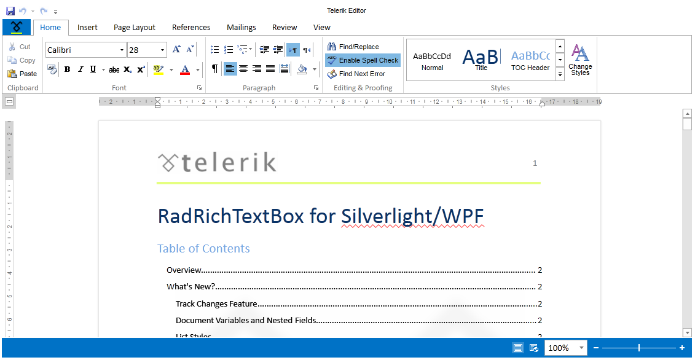
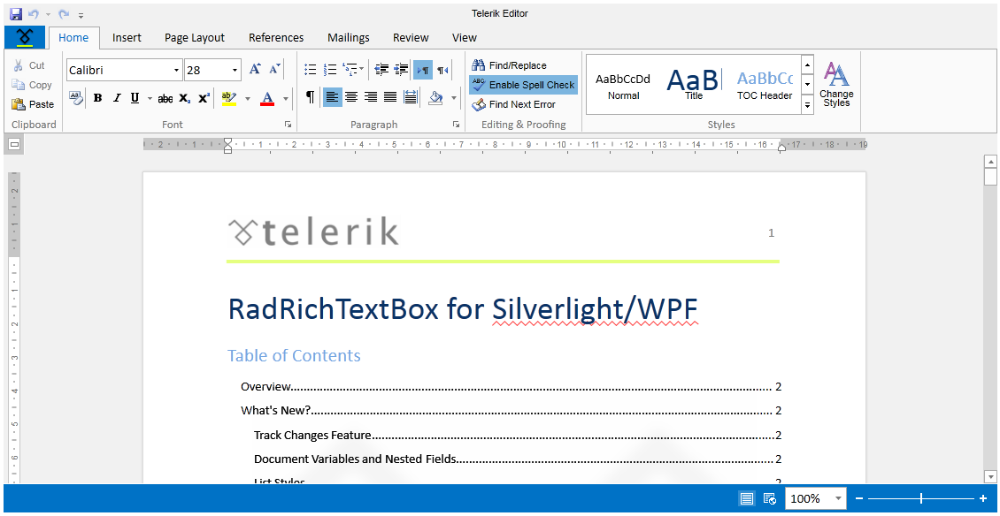
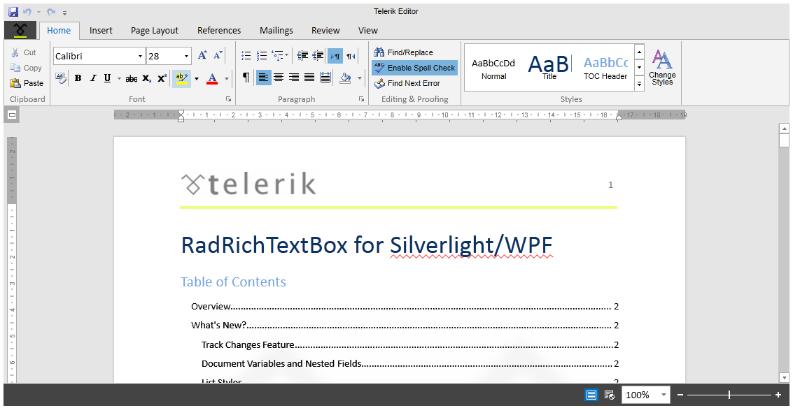

# Office2013 Theme

The official Q3 2013 release of UI for SilverlightWPF brought a brand new __external__ theme with a flat modern UI and three color
        variations – White, Light Gray, Dark Gray.
      

>importantThe theme is external which is why it can only be applied using [Implicit Styles](). For this purpose you
          need to add NoXaml binaries to your application.
        

The following topic explains the specifics of the theme's color variations.
      

## Theme Variations

The following are the supported color variations of the Office2013 theme

* __White__: White color theme palette. This is also the default variation of the theme.
            

* __LightGray__: Light gray theme palette.
            

* __DarkGray__: Dark gray theme palette.
            

This is how the __ColorVariation__ looks:
        

#### __C#__

{{region common-styling-appearance-office2013-theme_0}}
	    /// 

	    /// Represents theme color variations.
	    /// 

	    public enum ColorVariation
	    {
	        /// 

	        /// Represents Dark Grey Office2013 theme palette.
	        /// 

	        DarkGrey,
	
	        /// 

	        /// Represents Light Grey Office2013 theme palette.
	        /// 

	        LightGrey,
	
	        /// 

	        /// Represents the default White Office2013 theme palette.
	        /// 

	        White
	    }
	{{endregion}}

## Theme Variation Changing

When using NoXAML assemblies in an application you should merge the necessary resource dictionaries from the corresponding theme assembly (in this case
          - __Telerik.Windows.Themes.Office2013.dll__). Alternitevely, you can merge the resource dictionaries as *.xaml files in your
          application (in case there is no reference to the theme assembly) in an appropriate place in your project (i.e. App.xaml). For more information about
          implicit styles refer to [this article]().
        

The __Office2013__ theme offers a very intuitive and easy way to change its color variation. You can change the variation by
          using the __LoadPreset()__ method of __Office2013Palette__ in the entry point of your application. You just
          have to pass to the method the desired color variation as a parameter.
        

For example, if you want to set the __DarkGray__ color variation, you should have the following code-block in your application:
        

#### __C#__

{{region common-styling-appearance-office2013-theme_1}}
	        public MainWindow()
	        {
	            Office2013Palette.LoadPreset(Office2013Palette.ColorVariation.DarkGray);
	
	            InitializeComponent();
	        }
	{{endregion}}



#### __C#__

{{region common-styling-appearance-office2013-theme_2}}
	        public UserControl()
	        {
	            Office2013Palette.LoadPreset(Office2013Palette.ColorVariation.DarkGray);
	
	            InitializeComponent();
	        }
	{{endregion}}



## Office2013 Palette brushes and colors
<table> Office2013 Palette brushes and colors in ARGB mode<th><tr><td>

Brush name</td><td>

White</td><td>

Light Gray</td><td>

Dark Gray</td></tr></th><tr><td>

AccentMain</td><td>

FF0072C6</td><td>

FF0072C6</td><td>

FF0072C6</td></tr><tr><td>

Accent</td><td>

FF0072C6</td><td>

FF0072C6</td><td>

FF444444</td></tr><tr><td>

Main</td><td>

FFFFFFFF</td><td>

FFFFFFFF</td><td>

FFFFFFFF</td></tr><tr><td>

Inverted</td><td>

FF000000</td><td>

FF000000</td><td>

FF000000</td></tr><tr><td>

Basic</td><td>

FFFDFDFD</td><td>

FFFDFDFD</td><td>

FFFDFDFD</td></tr><tr><td>

Strong</td><td>

FF767676</td><td>

FF767676</td><td>

FF767676</td></tr><tr><td>

Validation</td><td>

FFFF0000</td><td>

FFFF0000</td><td>

FFFF0000</td></tr><tr><td>

LowLightMain</td><td>

FFF1F1F1</td><td>

FFF1F1F1</td><td>

FFF1F1F1</td></tr><tr><td>

LowLight</td><td>

FFFFFFFF</td><td>

FFF1F1F1</td><td>

FFE5E5E5</td></tr><tr><td>

LowDark</td><td>

FFFFFFFF</td><td>

FFFAFAFA</td><td>

FFF3F3F3</td></tr><tr><td>

MediumLight</td><td>

FFE1E1E1</td><td>

FFE1E1E1</td><td>

FFE1E1E1</td></tr><tr><td>

MediumDark</td><td>

FFC6C6C6</td><td>

FFC6C6C6</td><td>

FFC6C6C6</td></tr><tr><td>

HighLight</td><td>

FFD4D4D4</td><td>

FFC6C6C6</td><td>

FFABABAB</td></tr><tr><td>

HighDark</td><td>

FFABABAB</td><td>

FFABABAB</td><td>

FFABABAB</td></tr><tr><td>

EffectLow</td><td>

33FFFFFF</td><td>

33FFFFFF</td><td>

FF0072C6</td></tr><tr><td>

EffectHigh</td><td>

33000000</td><td>

33000000</td><td>

800072C6</td></tr><tr><td>

EffectAccentLow</td><td>

330072C6</td><td>

330072C6</td><td>

330072C6</td></tr><tr><td>

EffectAccentHigh</td><td>

800072C6</td><td>

800072C6</td><td>

800072C6</td></tr></table>

# See Also
