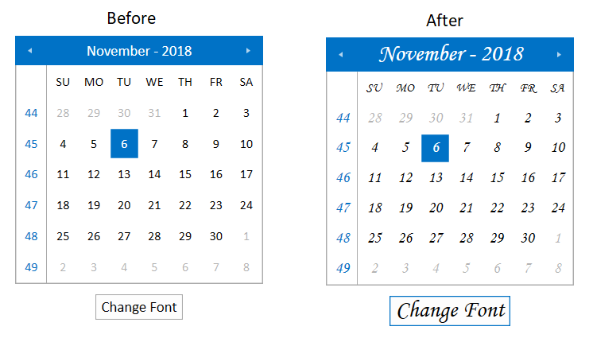

# Office2013 Theme

The official Q3 2013 release of UI for SilverlightWPF brought a brand new __external__ theme with a flat modern UI and three color variations – White, Light Gray, Dark Gray.      

>important Тhe Office2013 theme can only be applied using [Implicit Styles](). For this purpose you need to add NoXaml binaries to your application.        

The following topic explains the specifics of the theme's color variations and the available font options.      

## Theme Variations

The following are the supported color variations of the Office2013 theme

* __White__: White color theme palette. This is also the default variation of the theme.

* __LightGray__: Light gray theme palette.

* __DarkGray__: Dark gray theme palette.

This is how the __ColorVariation__ looks:        

#### __C#__
{{region common-styling-appearance-office2013-theme_0}}
	/// 

	/// Represents theme color variations.
	/// 

	public enum ColorVariation
	{
		/// 

		/// Represents Dark Grey Office2013 theme palette.
		/// 

		DarkGrey,

		/// 

		/// Represents Light Grey Office2013 theme palette.
		/// 

		LightGrey,

		/// 

		/// Represents the default White Office2013 theme palette.
		/// 

		White
	}
{{endregion}}

## Theme Variation Changing

When using NoXAML assemblies in an application you should merge the necessary resource dictionaries from the corresponding theme assembly (in this case - __Telerik.Windows.Themes.Office2013.dll__). Alternitevely, you can merge the resource dictionaries as *.xaml files in your application (in case there is no reference to the theme assembly) in an appropriate place in your project (i.e. App.xaml). For more information about implicit styles refer to [this article]().        

The __Office2013__ theme offers a very intuitive and easy way to change its color variation. You can change the variation by using the __LoadPreset()__ method of __Office2013Palette__ in the entry point of your application. You just have to pass to the method the desired color variation as a parameter.        

For example, if you want to set the __DarkGray__ color variation, you should have the following code-block in your application:


#### __C#__
{{region common-styling-appearance-office2013-theme_1}}
    public MainWindow()
    {
        Office2013Palette.LoadPreset(Office2013Palette.ColorVariation.DarkGray);

        InitializeComponent();
    }
{{endregion}}




#### __C#__

{{region common-styling-appearance-office2013-theme_2}}
    public UserControl()
    {
        Office2013Palette.LoadPreset(Office2013Palette.ColorVariation.DarkGray);

        InitializeComponent();
    }
{{endregion}}


## Office2013 Palette brushes and colors
|Brush name|White|Light Gray|Dark Gray|
|----------|-----|----------|---------|
|AccentMain|FF0072C6|FF0072C6|FF0072C6|
|Accent|FF0072C6|FF0072C6|FF444444|
|Main|FFFFFFFF|FFFFFFFF|FFFFFFFF|
|Inverted|FF000000|FF000000|FF000000|
|Basic|FFFDFDFD|FFFDFDFD|FFFDFDFD|
|Strong|FF767676|FF767676|FF767676|
|Validation|FFFF0000|FFFF0000|FFFF0000|
|LowLightMain|FFF1F1F1|FFF1F1F1|FFF1F1F1|
|LowLight|FFFFFFFF|FFF1F1F1|FFE5E5E5|
|LowDark|FFFFFFFF|FFFAFAFA|FFF3F3F3|
|MediumLight|FFE1E1E1|FFE1E1E1|FFE1E1E1|
|MediumDark|FFC6C6C6|FFC6C6C6|FFC6C6C6|
|HighLight|FFD4D4D4|FFC6C6C6|FFABABAB|
|HighDark|FFABABAB|FFABABAB|FFABABAB|
|EffectLow|33FFFFFF|33FFFFFF|FF0072C6|
|EffectHigh|33000000|33000000|800072C6|
|EffectAccentLow|330072C6|330072C6|330072C6|
|EffectAccentHigh|800072C6|800072C6|800072C6|

## Changing Fonts

The official Q1 2015 release of Telerik UI for WPFSilverlight introduced features that allow you to dynamically change the __FontSize__ and __FontFamily__ properties of all components in the application for the __Office2013__ theme. 

All Telerik controls use resources that are linked to one major singleton object that contains the __FontSize__ and __FontFamily__ properties used for the __Office2013__ theme. These properties are public so you can easily modify the theme resources at one single point. The most commonly used __FontSize__ in the theme is named __FontSizeL__ and its default value is *15*. The bigger font sizes are used for headers and footers while smaller ones are used inside complex controls such as __RadRibbonView__, __RadGauge__, __RadGanttView__, etc. As for the __FontFamily__ - there is only one __FontFamily__ resource which is named __FontFamily__ and it is set to *Calibri*.

>Please note that for complex scenarios we strongly recommend setting font size only initially before the application is initialized. We recommend font sizes between 11px and 19px for the __FontSize__ property.

All the available __FontSizes__ and __FontFamily__ as well as their __default values__:

#### __C#__
{{region common-styling-appearance-office2013-theme_3}}
	Office2013Palette.Palette.FontSizeXXS = 10;
	Office2013Palette.Palette.FontSizeXS = 12; 
	Office2013Palette.Palette.FontSizeS = 13;
	Office2013Palette.Palette.FontSize = 14;
	Office2013Palette.Palette.FontSizeL = 15;
	Office2013Palette.Palette.FontSizeXL = 16;
	Office2013Palette.Palette.FontFamily = new FontFamily("Calibri");
{{endregion}}

More details regarding the usage of the rarely used font sizes inside the different controls can be found below:

* Office2013Palette.Palette.FontSizeXXS is used:
	* GridViewNewRow in Telerik.Windows.Controls.GridView
	
* Office2013Palette.Palette.FontSizeXL is used:
	* ExpressionEditor in Telerik.Windows.Controls.Expressions
	* WizzardPage in Telerik.Windows.Controls.Navigation 
	* ScheduleView's MonthView items in Telerik.Windows.Controls.ScheduleView
	
As the following example shows, you can change the default __FontFamily__ from "Calibri" to "MonoType Corsiva" and the __FontSize__ from 15 to 16 on a click of a button:

#### __XAML__
{{region common-styling-appearance-office2013-theme_0}}
	<StackPanel>
		<StackPanel Orientation="Horizontal" HorizontalAlignment="Center">
			<telerik:RadCalendar x:Name="Calendar" Width="250" Height="250" Margin="4 10"/>
			<telerik:RadClock x:Name="Clock" Height="250" Margin="4 10" TimeInterval="0:0:1"/>
		</StackPanel>
		<telerik:RadButton x:Name="BtnChangeFontSize" VerticalAlignment="Center" 
						   HorizontalAlignment="Center" Content="Change Font"
						   Click="OnButtonChangeFontSizeClick" />
	</StackPanel>
</StackPanel>
{{endregion}}

#### __C#__
{{region common-styling-appearance-office2013-theme_4}}
	private void OnButtonChangeFontSizeClick(object sender, RoutedEventArgs e)
	{
		Office2013Palette.Palette.FontSize = 16;
		Office2013Palette.Palette.FontFamily = new FontFamily("MonoType Corsiva");
	}
{{endregion}}

This will be the final result:

# See Also
 * [Setting a Theme (Using  Implicit Styles)]()