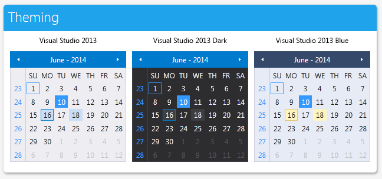

# VisualStudio2013 Theme

The official Q2 2014 release of UI for SilverlightWPF brought a brand new theme inspired by the Visual Studio design with three color variations – Light, Dark and Blue.
      

>importantNote that the VisualStudio2013 theme can only be applied using [Implicit Styles](). For this purpose you
          need to add NoXaml binaries to your application.
        

The following topic explains the specifics of the theme's color variations.
      

## Theme Color Variations

There are three palettes of colors which can be easily set by choosing one of the three default color variations:

The next screenshot display RadCalendar in the three color variations:

## Theme Variation Changing

You can switch the three color palettes by calling the __LoadPreset__ method as shown below:
        

#### __C#__

{{region common-styling-appearance-visualstudio2013-theme_0}}
	
	//default color variation
	VisualStudio2013Palette.LoadPreset(VisualStudio2013Palette.ColorVariation.Light);
	
	//blue color variation
	VisualStudio2013Palette.LoadPreset(VisualStudio2013Palette.ColorVariation.Blue);
	
	//dark color variation
	VisualStudio2013Palette.LoadPreset(VisualStudio2013Palette.ColorVariation.Dark); 
	{{endregion}}

## VisualStudio2013 Palette brushes and colors

Below you can find the differences between the three color variations. Every brush has relevant HEX value in the corresponding color variation.
<table>VisualStudio2013 Palette brushes and colors<th><tr><td>

Brush name</td><td>

Light (default)</td><td>

Dark</td><td>

Blue</td></tr></th><tr><td>

<b>Brushes, which are same</b>

<b> in the three palettes</b></td><td> </td><td> </td><td> </td></tr><tr><td>

AccentMainBrush</td><td>
              FF3399FF
            </td><td>
              FF3399FF
            </td><td>FF3399FF
            </td></tr><tr><td>

AccentDarkBrush</td><td>
              FF007ACC
            </td><td>
              FF007ACC
            </td><td>
              FF007ACC
            </td></tr><tr><td>

SelectedBrush</td><td>
              FFFFFFFF
            </td><td>
              FFFFFFFF
            </td><td>
              FFFFFFFF
            </td></tr><tr><td>

ValidationBrush</td><td>
              FFFF3333
            </td><td>
              FFFF3333
            </td><td>
              FFFF3333
            </td></tr><tr><td>

<b>Brushes, which are different</b>

<b> in the three palettes</b></td><td> </td><td> </td><td> </td></tr><tr><td>

AccentBrush</td><td>
              FF007ACC
            </td><td>
              FF007ACC
            </td><td>
              FFE5C365
            </td></tr><tr><td>

MarkerBrush</td><td>
              FF1E1E1E
            </td><td>
              FFF1F1F1
            </td><td>
              FF1E1E1E
            </td></tr><tr><td>

StrongBrush</td><td>
              FF717171
            </td><td>
              FF999999
            </td><td>
              FF717171
            </td></tr><tr><td>

MainBrush</td><td>
              FFFFFFFF
            </td><td>
              FF1E1E1E
            </td><td>
              FFFFFFFF
            </td></tr><tr><td>

PrimaryBrush</td><td>
              FFEEEEF2
            </td><td>
              FF2D2D30
            </td><td>
              FFE6EBF5
            </td></tr><tr><td>

AlternativeBrush</td><td>
              FFF5F5F5
            </td><td>
              FF252526
            </td><td>
              FFF6F6F6
            </td></tr><tr><td>

MouseOverBrush</td><td>
              FFC9DEF5
            </td><td>
              FF3E3E40
            </td><td>
              FFFDF4BF
            </td></tr><tr><td>

BasicBrush</td><td>
              FFCCCEDB
            </td><td>
              FF3F3F46
            </td><td>
              FFCCCEDB
            </td></tr><tr><td>

SemiBasicBrush</td><td>
              66CCCEDB
            </td><td>
              663F3F46
            </td><td>
              66CCCEDB
            </td></tr><tr><td>

HeaderBrush</td><td>
              FF007ACC
            </td><td>
              FF007ACC
            </td><td>
              FF35496A
            </td></tr><tr><td>

ComplementaryBrush</td><td>
              FFDBDDE6
            </td><td>
              FF434346
            </td><td>
              FFDBDDE6
            </td></tr><tr><td>

<b>Additional color</b></td><td> </td><td> </td><td> </td></tr><tr><td>

DefaultForegroundColor*</td><td>
              FF1E1E1E
            </td><td>
              FFF1F1F1
            </td><td>
              FF1E1E1E
            </td></tr></table>

* __DefaultForegroundColor__ is the only resource of type Color and not a SolidColorBrush in VisualStudio2013 palette. Currently it is used only in the ExpressionEditor.

### Theme Palette brushes description

Here you can find more details about each brush and where it is usually applied.

The first four colors have the same value in the three color variations and they are commonly used among all controls: 

The colors that have different HEX value can be ordered by purpose.

First we needed another accent brush which has the same value as AccentDarkBrush for the Light and Dark color variations of VisualStudio2013 theme, but orange in the Blue color variation. This was necessary due to our aim to be as much closer as possible to the Visual Studio's product design.

There are two brushes usually used for foregrounds: 

There are six brushes usually used for background and border color:

Some controls such as Window, RibbonView, ScheduleView, Docking Pane, Docking ToolWindow, TileView have headers with a specific brush for background:

Additional brush is introduced rarely used for elements in Disabled state:

The following screenshot shows the usage of some of the brushes:

# See Also

 * [Setting a Theme (Using  Implicit Styles)]()
