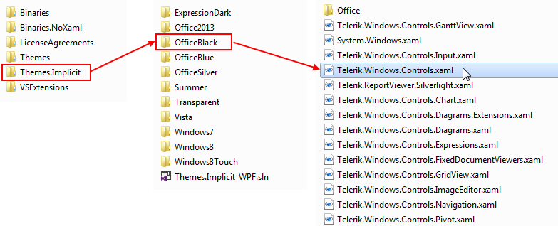
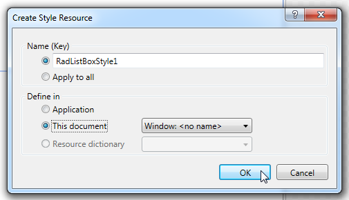

# Editing Control Templates

This article will show you two different approaches on how to extract and edit the default control templates of the UI for SilverlightWPF controls.

* [Extracting Control Templates Manually from the Theme XAML File](#extracting-control-templates-manually-from-the-theme-xaml-file)
* [Extracting Control Templates Using Visual Studio](#extracting-control-templates-using-visual-studio)

## Extracting Control Templates Manually from the Theme XAML File

Inside the installation folder of your version of UI for SilverlightWPF you can find a folder named __Themes.Implicit__. It contains the **XAML** files of the different themes for all the controls.

You then have to navigate to the required theme and open the needed XAML file with your favorite editor. For example, if you are using the **Office_Black** theme and you need the control template of the **RadListBox** control, you should go in the **OfficeBlack** folder and find the __Telerik.Windows.Controls.xaml__ file which usually corresponds to the name of the assembly the control is located in.

#### __Figure 1: Navigating to the required XAML file__

>important You should extract the desired control template from the theme you are using in your application as there are differences between the templates in the different themes. Not using the correct template may lead to errors or cause undesired behavior.

When you have the file open in an editor you have to find the default style for the given control. The default styles usually follow the convention **name of the control + Style**, for example - **RadListBoxStyle**. 

After you locate the style you should navigate to the value of its **Template** property setter which will point you to the control template. Once you have copied the template you can easily modify it and apply it either to a single instance of the control or throughout your application by creating the appropriate style and setting its **Template** property.

For example, if you want to add a rounded red border around the **RadListBox** control you should extract the respective control template and modify it as demonstrated in **Example 1**.

#### __[XAML] Example 1: Adding a border around the RadListBox control__

{{region xaml-styling-apperance-editing-control-templates_0}}
	<Application.Resources>
	    <ResourceDictionary>
	        <ResourceDictionary.MergedDictionaries>
	            <ResourceDictionary Source="/Telerik.Windows.Themes.Office_Black;component/Themes/Telerik.Windows.Controls.xaml"/>
	        </ResourceDictionary.MergedDictionaries>
	        
	        
	    </ResourceDictionary>
	</Application.Resources>
{{endregion}}

**Figure 2** shows the resulting control.

#### __Figure 2: RadListBox control with red border__

## Extracting Control Templates Using Visual Studio

The other way to extract a control template is through the **Visual Studio designer**. You have to right click on the desired control and navigate through the context menu to the __Edit Template__ option. Afterwards just click on the __Edit a Copy__ option as shown in **Figure 3**.

#### __Figure 3: Visual Studio designer context menu__

The **Create Style Resource** dialog will appear, providing you with a few choices. 

The first option is to extract the style with the default control template in a specified document with a resource key. You can choose this option if you need to apply it on a single instance of the control.

#### __Figure 4: Generating a style with a resource key__

The second option is to create an implicit style.

#### __Figure 5: Generating an implicit style__

Let's assume you just need to style one specific instance of the control and you have chosen to extract the style with a resource key in the current document. **Example 2** shows the generated XAML code.

#### __[XAML] Example 2: The generated XAML code__

{{region styling-apperance-editing-control-templates_1}}
	<Window>
	    <Window.Resources>
	        
	    </Window.Resources>
	
	    <Grid>
	        <telerik:RadListBox Style="{StaticResource RadListBoxStyle1}" ItemsSource="{Binding ListBoxItems}" />
	    </Grid>
	<Window>
{{endregion}}

## See Also

 * [Setting a Theme]()
