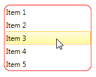
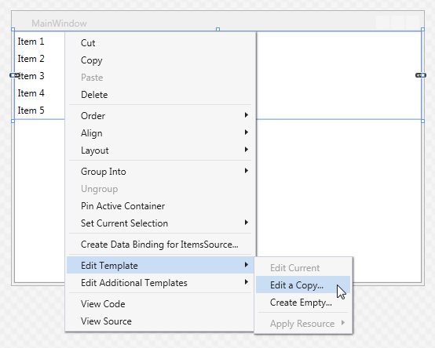
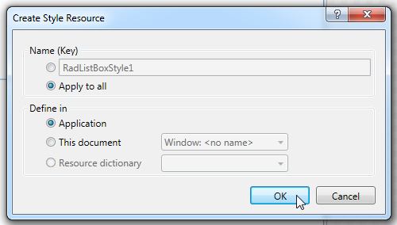

# Editing Control Templates

Using Implicit Styles gives you the ability to easily extract and edit the default ControlTemplates of the controls. This article will show you two different approaches on how to extract the ControlTemplates.        
      

## Extracting Control Templates Manually from the Theme XAML file

In the installation folder of your version of UI for SilverlightWPF you can find a folder named __Themes.Implicit__. It contains the XAML files of the different Themes for all the controls. So you basically have to navigate to the required Theme and open the needed XAML file in Visual Studio. For example if you are using the OfficeBlack Theme and you need the ControlTemplate of RadListBox you should go in the OfficeBlack folder, then into Themes folder and find the __Telerik.Windows.Controls.xaml__ file.

>You should extract the desired ControlTemplate from the Theme you are using as there are differences between the Themes. Not having the correct Template may cause the control to misbehave.
          

When you have the file open in Visual Studio you have to find the default style of the control. The default styles are usually named the following way: *name of the control* + Style (for example *RadListBoxStyle*). So after you locate the style you should navigate to the Value of its Template property Setter which will contain the desired ControlTemplate. Once you have copied the Template you can easily modify it and apply it either to a single instance of the Control by using its Template property or globally to all instances of the Control in the App.xaml file.
        

>For the case you want to apply a single ControlTemplate to all instances of the Control in Application you will need to create a Style which targets the Control and it is based on its default Style. 
          

As an example if you need to add a rounded red Border around ItemsPresenter in the ListBox Control you should do the following:
        

#### __XAML__

{{region styling-apperance-editing-control-templates_0}}
	<Application.Resources>
	    <ResourceDictionary>
	        <ResourceDictionary.MergedDictionaries>
	            <ResourceDictionary Source="/Telerik.Windows.Themes.Office_Black;component/Themes/Telerik.Windows.Controls.xaml"/>
	        </ResourceDictionary.MergedDictionaries>
	        
	        
	        
	    </ResourceDictionary>
	</Application.Resources>
	{{endregion}}

And here is the result:

## Extracting Control Templates Using Visual Studio

The other way to extract a ControlTemplate is through the Visual Studio designer. You have to right click on the desired Control and navigate through the open context menu to the __Edit Template__ option. Afterwards just click on the __Edit a Copy__ option as shown below:

Create Style Resource dialog will appear, providing you with a few choices. You basically could either extract the Style with the default ControlTemplate in the desired document with a resource key (if you need to apply it on a single instance of the control):

Or you could apply it to all the instances of the Control within the document or the Application by selecting the following:

Let's assume you just need to style one specific instance of the Control and you have chosen to extract the Style with a Key in this document. The result is shown in the next code snippet:
        

#### __XAML__

{{region styling-apperance-editing-control-templates_1}}
	<Window>
	    ...
	    <Window.Resources>
	        
	    </Window.Resources>
	
	    <Grid>
	        <telerik:RadListBox Style="{StaticResource RadListBoxStyle1}" ItemsSource="{Binding ListBoxItems}" />
	    </Grid>
	<Window>
	{{endregion}}

# See Also

 * [Setting a Theme (Using  Implicit Styles)]()
