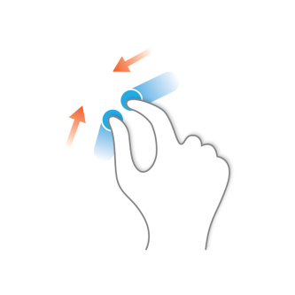
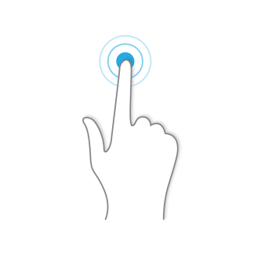

# Touch Support

Telerik UI for WPFSilverlight now provides touch support. The functionality
        is built on top of an internally implemented framework to provide the needed extensibility and the ability for each of the specific controls in the
        suite to support only the needed for it gestures.
      

## Gestures

Touch gestures describe gestures in which you use a finger or stylus to a movement over a control or object on the screen. These are the commonly
          supported ones for the suite:
        
<table><tr><td></td><td>

Swipe</td><td>

The user presses and holds on the screen and then drags the finger / stylus in any direction.</td></tr><tr><td></td><td>

Pinch</td><td>

The user touches the screen with two (or more) fingers and moves them inwards or outwards.</td></tr><tr><td></td><td>

Tap</td><td>

The user touches the screen.</td></tr><tr><td></td><td>

Tap and Move</td><td>

The user presses and holds the screen for few seconds (between 600ms and 1500ms) and drags his finger / stylus in any direction.</td></tr><tr><td></td><td>

Tap and Hold</td><td>

The user presses and holds the screen for a few seconds (more than 1500ms).</td></tr></table>

## Controls Behavior

Below are listed the controls and their behavior with the different gestures:
<table> <th><tr><td>

Control</td><td>

Swipe</td><td>

Pinch</td><td>

Tap</td><td>

Tap and Move</td><td>

Tap and Hold</td><td>

Custom</td></tr></th><tr><td>

RadCalendar</td><td>

Next/Previous</td><td>

Semantic zoom (only outwards)</td><td>

Click</td><td>

-</td><td>

-</td><td>

-</td></tr><tr><td>

RadChartView</td><td>

Scroll</td><td>

Zoom</td><td>

Click/Selection/Tooltip</td><td>

Trackball</td><td>

Show ToolTip</td><td>

-</td></tr><tr><td>

RadComboBox</td><td>

Scroll DropDown</td><td>

-</td><td>

Click</td><td>

-</td><td>

-</td><td>

-</td></tr><tr><td>

RadCoverFlow</td><td>

Scroll with inertia</td><td>

-</td><td>

Click</td><td>

Scroll (if possible)</td><td>

-</td><td>

-</td></tr><tr><td>

RadDiagram</td><td>

Pan</td><td>

Zoom</td><td>

Select</td><td>

Scroll</td><td>

-</td><td>

-</td></tr><tr><td>

RadGanttView</td><td>

Scroll with inertia</td><td>

Zoom</td><td>

Click</td><td>

On item - Drag&Drop; on slot - Scroll</td><td>

-</td><td>

-</td></tr><tr><td>

RadGauge</td><td>

-</td><td>

-</td><td>

Click</td><td>

Moves indicators</td><td>

Shows tooltip</td><td>

-</td></tr><tr><td>

RadGridView</td><td>

Scroll</td><td>

-</td><td>

Click</td><td>

-</td><td>

Shows a circle to be dragged</td><td>

-</td></tr><tr><td>

RadImageEditor</td><td>

Scroll</td><td>

Zoom</td><td>

-</td><td>

-</td><td>

-</td><td>

-</td></tr><tr><td>

RadListBox</td><td>

Scroll with inertia</td><td>

-</td><td>

Click</td><td>

Drag&Drop</td><td>

-</td><td>

-</td></tr><tr><td>

RadMap</td><td>

Scroll</td><td>

-</td><td>

Click/Selection</td><td>

-</td><td>

-</td><td>

Double Tap -> Zoom</td></tr><tr><td>

RadPdfViewer</td><td>

Scroll</td><td>

Zoom</td><td>

Click</td><td>

-</td><td>

-</td><td>

Selection markers to extend the selection</td></tr><tr><td>

RadRichTextBox</td><td>

Scroll</td><td>

Zoom</td><td>

Click (move caret to position)</td><td>

-</td><td>

Show context menu</td><td>

Selection markers to extend the selection</td></tr><tr><td>

RadScheduleView</td><td>

Horizontally - Previous/Next

Vertically - Scroll</td><td>

Semantic zoom</td><td>

Click/Selection</td><td>

On item - Drag&Drop; on slot - Scroll</td><td>

-</td><td>

-</td></tr><tr><td>

RadSpreadsheet</td><td>

Scroll</td><td>

Zoom</td><td>

Click</td><td>

-</td><td>

-</td><td>

Selection markers to extend the selection</td></tr><tr><td>

RadTimeBar</td><td>

Scroll</td><td>

Zoom</td><td>

Click/Selection</td><td>

Moves Selection</td><td>

Selection</td><td>

Double Tap -> Extends selection</td></tr><tr><td>

RadTimeline</td><td>

Scroll</td><td>

Zoom</td><td>

Click/Selection</td><td>

Selection</td><td>

Shows tooltip</td><td>

-</td></tr><tr><td>

RadTreeListView</td><td>

Scroll</td><td>

-</td><td>

Click</td><td>

-</td><td>

Shows a circle to be dragged</td><td>

-</td></tr><tr><td>

RadTreeMap</td><td>

-</td><td>

-</td><td>

Selection</td><td>

-</td><td>

Shows tooltip</td><td>

-</td></tr><tr><td>

RadTreeView</td><td>

Scroll</td><td>

-</td><td>

Select</td><td>

Scroll</td><td>

-</td><td>

-</td></tr><tr><td>

RadTileList</td><td>

Scroll</td><td>

-</td><td>

Select</td><td>

Reorder</td><td>

-</td><td>

-</td></tr></table>

## TouchManager States

As of version __Q2 2014__, we have introduced a new __IsTouchEnabled__ property, which __controls the state of TouchManager on application level__.
        

>importantThe property is of boolean type and its Default value is True.
          

__Setting it to False__ will destroy any existent TouchHandlers and unsubscribe from any MS TouchEvents internally. This will also prevent the further creation of such handlers until it is set back to True.
        

__Setting it to True on a later stage__ will again turn on the creation of new elements, however, it will not restore any of the previously disposed ones.
        

>In order to restore full touch support, you will need to reload the affected controls in the visual tree.
          

# See Also
