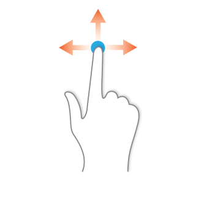
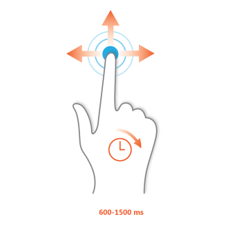
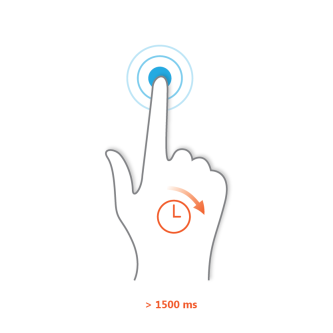

# Touch Support

Telerik UI for WPFSilverlight now provides touch support. The functionality is built on top of our [TouchManager]() framework which provides the needed extensibility and the ability for each of the specific controls in the suite to support only the needed for it gestures.
      
## Gestures

Touch gestures describe gestures in which you use a finger or stylus to a movement over a control or object on the screen. These are the commonly supported ones for the suite:

Gesture | - | Description 
---	|	---	|	---	
 | Swipe | The user presses and holds on the screen and then drags the finger / stylus in any direction.
	|	Pinch	|	The user touches the screen with two (or more) fingers and moves them inwards or outwards.
	|	Tap	|	The user touches the screen. 
	|	Tap and Move	|	The user presses and holds the screen for few seconds (between 600ms and 1500ms) and drags his finger / stylus in any direction.
	|	Tap and Hold	|	The user presses and holds the screen for a few seconds (more than 1500ms).

>As of version __Q2 2015__, the __TouchIndicator is represented by a single circle__. 

## Controls Behavior

Below are listed the controls and their behavior with the different gestures:

Control | Swipe	|	Pinch	|	Tap	|	Tap and Move	|	Tap and Hold	|	Custom
---	| ---	|	---	|	---	|	---	|	---	|	---
RadCalendar | Next/Previous	|	Semantic zoom (only outwards)	|	Click	|	-	|	-	|	-
RadCarousel | Next/Previous	|	-	|	Click/Selection	|	-	|	-	|	-
RadChartView | Scroll	|	Zoom	|	Click/Selection/Tooltip	|	Trackball	|	Show ToolTip	|	-
RadComboBox | Scroll DropDown	|	-	|	Click	|	-	|	-	|	-
RadCoverFlow | Scroll with inertia	|	-	|	Click	|	Scroll (if possible)	|	-	|	-
RadDiagram | Pan with Inertia	|	Zoom	|	Select	|	Scroll	|	Shows circle for Rectangle Selection	|	Tap and Hold and Move will start a rectangle Selection
RadGanttView | Scroll with inertia	|	Zoom	|	Click	|	On item - Drag&Drop; on slot - Scroll	|	-	|	-
RadGauge | -	|	-	|	Click	|	Moves indicators	|	Shows tooltip	|	-
RadGridView | Scroll	|	-	|	Click/Selection	|	HeaderCell/GroupPanelItem - Drag&Drop	|	-	|	-
RadImageEditor | Scroll	|	Zoom	|	-	|	-	|	-	|	-
RadListBox | Scroll with inertia	|	-	|	Click	|	Drag&Drop	|	-	|	-
RadMap | Pan	|	Zoom	|	Click/Selection	|	-	|	-	|	Double Tap -> Zoom
RadPdfViewer | Scroll	|	Zoom	|	Click	|	-	|	-	|	Selection markers to extend the selection
RadRropertyGrid | Scroll	|	-	|	Click/Selection	|	-	|	-	|	-
RadRichTextBox | Scroll	|	Zoom	|	Click (move caret to position)	|	-	|	Show context menu	|	Selection markers to extend the selection
RadScheduleView | Horizontally - Previous/Next; Vertically - Scroll	|	Timeline - Zoom, others - switching the views	|	Click/Selection	|	On item - Drag&Drop; on slot - Scroll	|	-	|	-
RadSpreadsheet | Scroll	|	Zoom	|	Click	|	-	|	-	|	Selection markers to extend the selection
RadTimeBar | Scroll	|	Zoom	|	Click/Selection	|	Moves Selection	|	Selection	|	Double Tap -> Extends selection
RadTimeline | Scroll	|	Zoom	|	Click/Selection	|	Selection	|	Shows tooltip	|	-
RadTreeListView | Scroll	|	-	|	Click	|	-	|	Shows a circle to be dragged	|	-
RadTreeMap | -	|	-	|	Selection	|	-	|	Shows tooltip	|	-
RadTreeView | Scroll with Inertia	|	-	|	Click/Selection/Expand	|	-	|	Shows touch Indicator	|	Tap and Hold and Move will Start Drag operation
RadTileList | Scroll	|	-	|	Selection	|	-	|	-	|	-

## TouchManager States

As of version __Q2 2014__, we have introduced a new __IsTouchEnabled__ property, which controls the state of TouchManager on application level. Setting it to False will prevent any touch events to be fired.
        
>important The property is of boolean type and its Default value is True.         

> You can also take a look at the [Touch Modes]() help article
 
