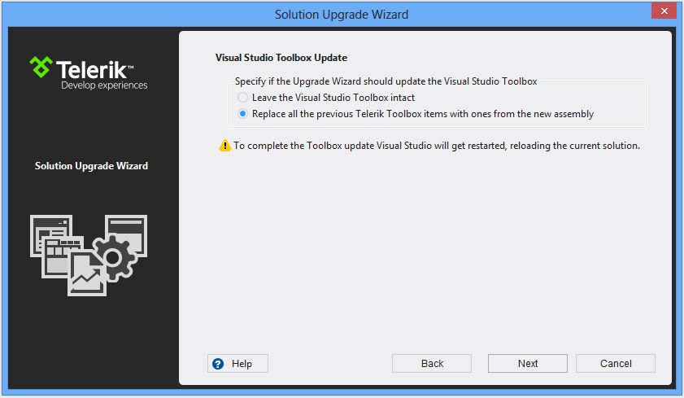

# Upgrading to a new UI for Silverlight distribution

## 

An important feature in the __Visual Studio Extensions__ is __Project Upgrade Wizard__. 

The Upgrade Wizard (started by using the __Telerik > UI for Silverlight > Upgrade Wizard__menu item) is used to change the version of UI for Silverlight your project uses. 

In addition to the pure assembly reference change, the upgrade wizard provides several important features: 

* Check if a new version of __UI for Silverlight__is available on the Telerik website. 

* Download of a newly discovered version. 

* Visual Studio toolbox update. 

* Current project backup. 

On the first step the wizard lists all projects from the solution, which use UI for Silverlight. 
          You can choose which projects will be updated (it is recommended to upgrade all projects to the chosen version, 
          not just part of them) and the version which they will be upgraded to and whether or not all binaries should get copied to your solution folder
          (useful when utilizing a build server or working on a project collaboratively):

The next screen allows you to update the Visual Studio Toolbox with the newly selected controls, so that you avoid accidental reference change during a control drag and drop:

The last step suggests creating a backup of your project: 

Notes: 

* The distribution selection screen lists all the UI for Silverlight versions that can be detected automatically. These are versions, installed by using the Windows Installer MSI package, versions, downloaded by the Upgrade Wizard and versions, available in the GAC. Hotfixes, downloaded manually cannot be detected.

* You can use the Browse button to navigate to the folder of a manually downloaded distribution.  

* You can use the Download button to access the Latest Version Acquirer in order to download the latest available version on our website. 

* The distribution, downloaded by the Upgrade Wizard contains only the "hotfix" files, e.g. the barebone files, needed for a project to run correctly. It does not contain the documentation or the Live Examples.

* A Visual Studio restart will be required in order to update your toolbox. If the automatic restart fails, a restart should be initiated manually in order to complete the toolbox upgrade.

# See Also

 * [Project creation and configuration]()

 * [Automatic Dependency resolving]()

 * [Latest Version Acquirer Tool]()
