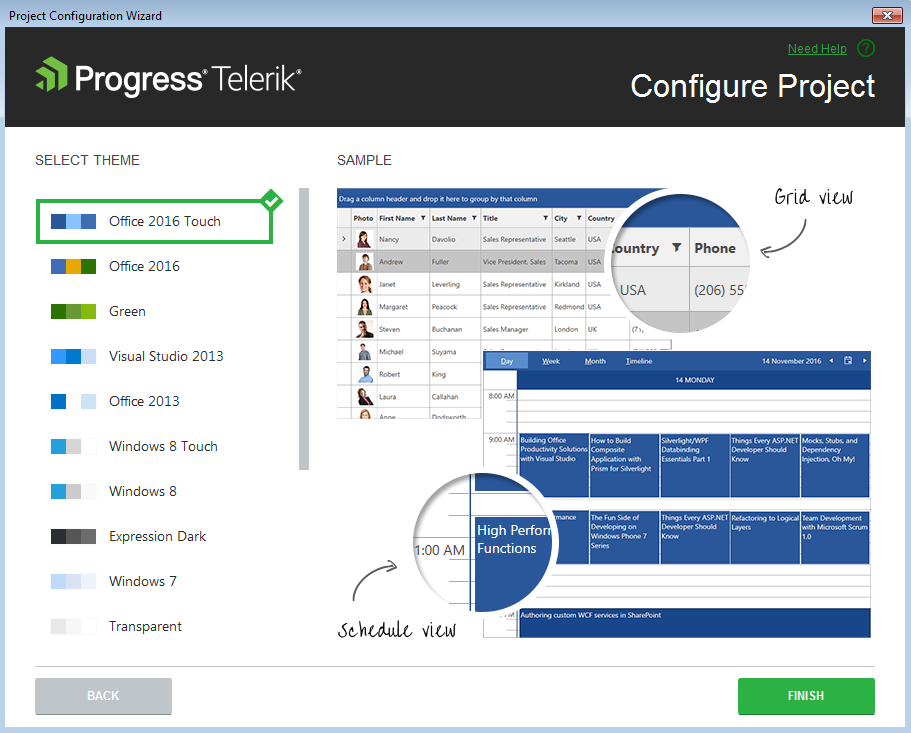

# Configure Project
 
__Configure Telerik WPF Application__

You can access the Project Configuration Wizard through the Telerik menu when you need to configure your Telerik WPF application:

The wizard could be also reached through the context menu counterparts accessed by right clicking on the project you want to convert. 

The Project Configuration Wizard’s first page lets you:

       

* Specify which assemblies your project would use. When selecting a Telerik UI for WPF assembly all dependent controls are selected automatically and vice-versa.
         
Through the Project Configuration Wizard’s second page you can:

* Select which theme will be applied to your project. Check the content of each theme or see the preview of it when select it into the Project Configuration Wizard:

>The Project Configuration Wizard’s second page is only available if you use theming based on implicit styles. ([more information]())           

When you click the Finish button:
        

* The selected assembly references get added to your project
          

* A default application-wide theme gets set if you use theming based on implicit styles.
          

## See Also

 * [Automatic Dependency Resolving]()

 * [Upgrade Project]()

 * [Download New Version]()

 * [Setting a Theme]()
