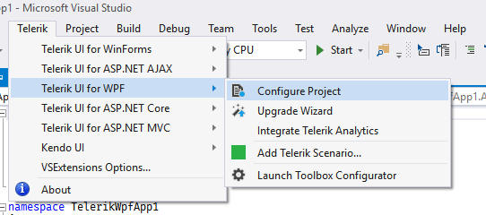
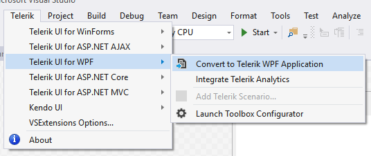
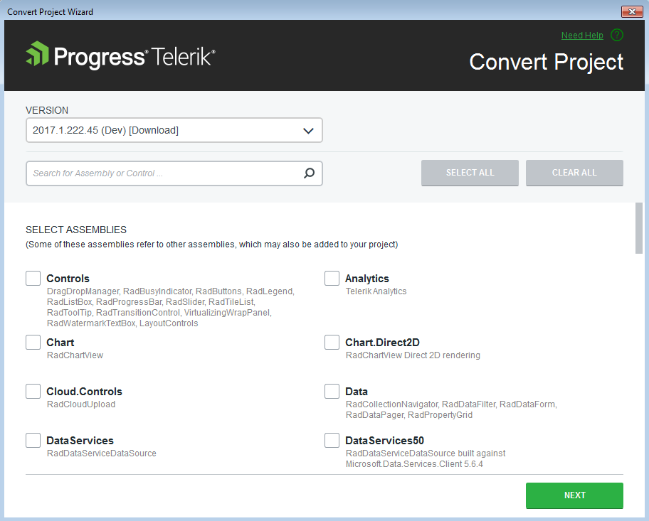

# Project creation and configuration

With the new Visual Studio Extensions for WPF you can quickly create an application pre-configured to use Telerik UI for WPF. The fastest way to have such a project is using the Visual Studio __New Project Wizard__. Under the __Telerik__ node there is a new node – __Windows__, where four project templates exist: 

For convenience the same project templates could be found under the __Visual C# -> Windows__ and __Visual Basic -> Windows__ nodes. 

After you click the __OK__ button, you get the Project Configuration Wizard, provided by the Telerik UI for WPF Visual Studio Extensions. The wizard detects all the installed __Use Implicit Styles__ distributions of UI for WPF and lists them in a combobox. You can select a distribution which you want to be applied to your project. You can select what type of project to be created from the Choose project type combobox: Standard, Word-Inspired, Excel-Inspired or Outlook-Inspired. You can access the Project Configuration Wizard through the Telerik menu when you need to configure your Telerik WPF application or you need to convert an existing WPF application to a Telerik WPF application. These depend on the active project in the Visual Studio Solution Explorer:

__Configure Telerik WPF Application__

__Convert to Telerik WPF Application__

Both menus have their context menu counterparts accessed by right clicking on the project you want to convert or configure. 

The Project Configuration Wizard lets you tune your project's use of UI for WPF.

The Project Configuration Wizard’s first page lets you:
        

* Select a Telerik UI version from the list of versions detected on your system

* Download the latest versions available on our website using the __GET LATEST__ button

>The Project Configuration Wizard’s second page is only available if you use theming based on implicit styles. ([more information]())
          

Through the Project Configuration Wizard’s third page you can:
        

* Select the way you want themes to be applied in your project via referencing theme assembly
            

When you click the Finish button:
        

* The selected assembly references get added to your project
          

* A default application-wide theme gets set if you use theming based on implicit styles.
          

# See Also

 * [Automatic Dependency resolving]()

 * [Upgrading to a new UI for WPF distribution]()

 * [Latest Version Acquirer Tool]()

 * [Setting a Theme (Using  Implicit Styles)]()
