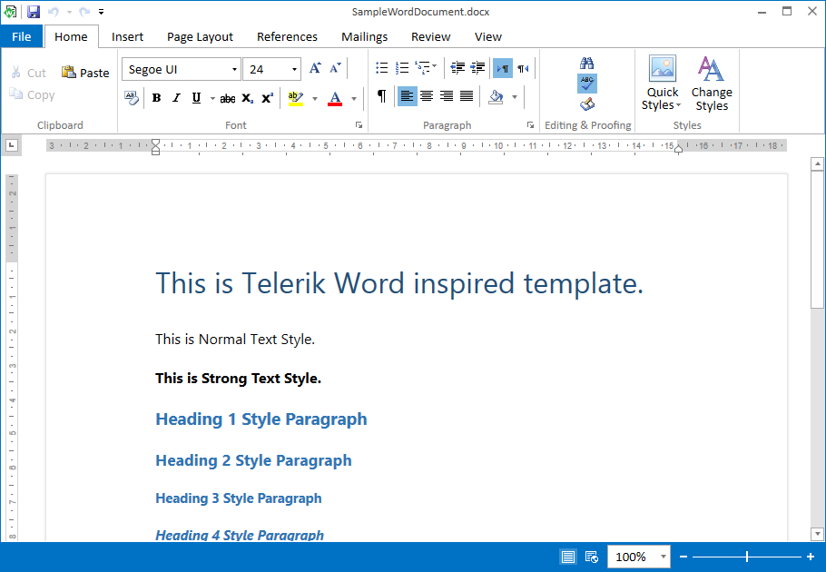
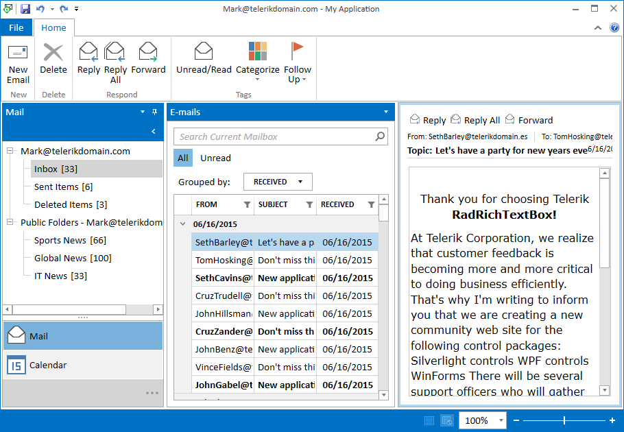
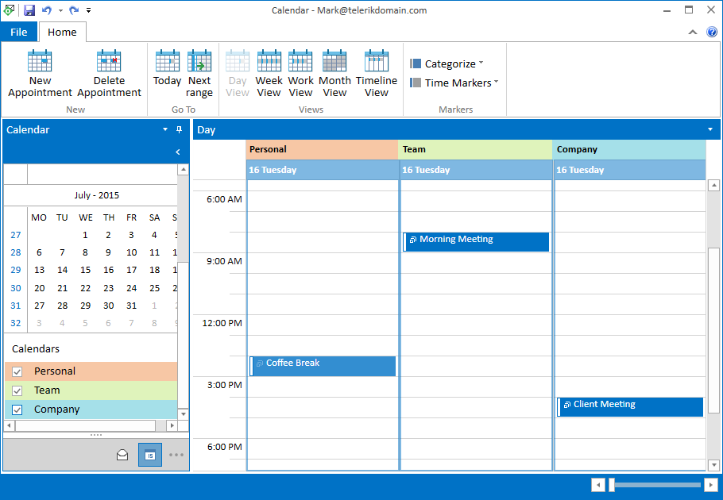

# Visual Studio Templates

With the official Q1 2015 release of __Telerik UI for WPF__ the __[Project Configuration Wizard]()__ provides few built in __Visual Studio Templates__. Now it is possible with just a few clicks to start building Windows inspired application. Currently you have the option to choose from the following templates: 

* [Word-Inspired Template](#word-inspired-template)

* [Excel-Inspired Template](#excel-inspired-template)

* [Outlook-Inspired Template](#outlook-inspired-template) (available with Q2 2015 release version)

* [Outlook-Inspired Mail Template](#outlook-inspired-mail-template) (available with Q2 2015 release version)

* [Outlook-Inspired Calendar Template](#outlook-inspired-calendar-template) (available with Q2 2015 release version)

>All the templates are prepared with the __[Office 2013 theme]()__ and use __[Implicit Styles]()__.

In this article you will find more information on how to create a project from one of the available templates as well as more details regarding what controls each template contains.

## Getting Started

When creating new project, select the needed template as seen on __Figure 1__.

__Figure 1: Select template__

## Word-Inspired Template

The __Word-Inspired Template__ implements Word-like editing experience represented with the __Telerik UI for WPF__ controls. It provides a complex integration of controls like __RadRibbonWindow__, __RadRibbonView__ and __RadRichTextBox__ in an already set up example. It also demonstrates the broad range of editing and formatting capabilities as well as built in specific features of these controls. In fact the __Word-Inspired Template__ is almost identical to the RadRichTextBox' TelerikEditor example in our __[WPF demos](http://demos.telerik.com/wpf/)__, however it have been visually improved in order to look like the MS Word.

__Figure 2: Word-Inspired Template__

## Excel-Inspired Template

The __Excel-Inspired Template__ implements Excel-like editing experience represented with the __Telerik UI for WPF__ controls. It provides a complex integration of controls like __RadRibbonWindow__, __RadRibbonView__ and __RadSpreadSheet__ in an already set up example. It also demonstrates the broad range of editing and formatting capabilities as well as built in specific features of these controls. In fact the __Word-Inspired Template__ is almost identical to the RadSpreadSheet' Theming example in our __[WPF demos](http://demos.telerik.com/wpf/)__, however it have been visually improved in order to look like the MS Word.

__Figure 3: Excel-Inspired Template__

## Outlook-Inspired Template

In this template we joined the powers of some of the most prominent controls in __Telerik UI for WPF__ to create one of the most recognizable applications in the world – Microsoft Outlook. You can easily spot __RadGridView__, __RadRichTextBox__, __RadScheduleView__, __RadDocking__ and __RadCalendar__ how blend seamlessly. The Visual Studio template can be used for a quick start of any other business application. The __Outlook-Inspired Template__ is built from two separate templates available in Visual Studio – __Outlook-Inspired Mail Template__ and __Outlook-Inspired Calendar Template__. They are separated so you can use only the needed functionality in the cases in which you need only the email interface or the calendar one. 

The template is designed with MVVM in mind which is why most of the events that are required in achieving its functionality are passed to the ViewModel via __[EventToCommandBehavior]()__. There are a few scenarios which are not achievable via __EventToCommandBehavior__ and they are left in the code behind of the MainView. 

Full list of controls used in the __Outlook-Inspired Template__ can be found below:

* EventToCommandBehavior
* RadBusyIndicator
* RadCalendar
* RadContextMenu
* RadDocking
* RadGridView
* RadOutlookBar
* RadRibbonWindow
* RadRibbonButton
* RadRibbonSplitButton
* RadRibbonTab
* RadRibbonComboBox
* RadRichTextBox
* RadRichTextBoxRibbonUI
* RadRichTextBoxStatusBar
* RadRadioButton
* RadScheduleView

You can see how the different parts of the template look like on __Figure 4__ and __Figure 5__.

## Outlook-Inspired Mail Template

The Outlook-Inspired Mail Template can be used separately and it has been integrated as the mail part of the [Outlook-Inspired Template](#outlook-inspired-template). You can see it on __Figure 4__.

__Figure 4: Outlook-Inspired Mail Template__

## Outlook-Inspired Calendar Template

The Outlook-Inspired Calendar Template can be used separately and it has been integrated as the calendar part of the [Outlook-Inspired Template](#outlook-inspired-template). You can see how the template looks like on __Figure 5__.

__Figure 5: Outlook-Inspired Calendar Template__

## See Also

* [Project Configuration Wizard]()

* [Office 2013 Theme]()
