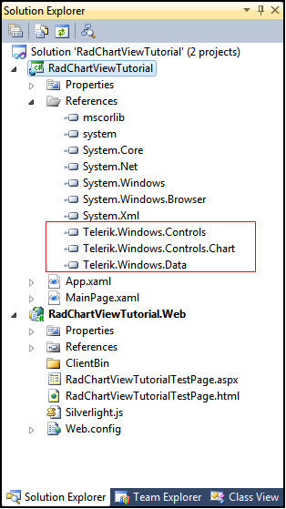
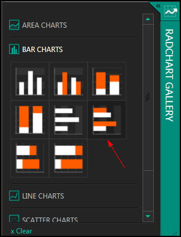
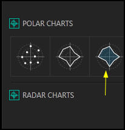
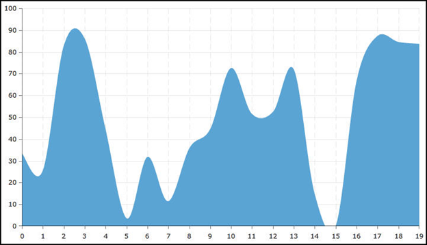
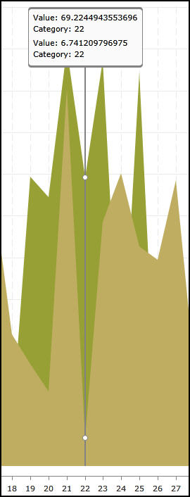
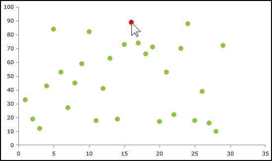
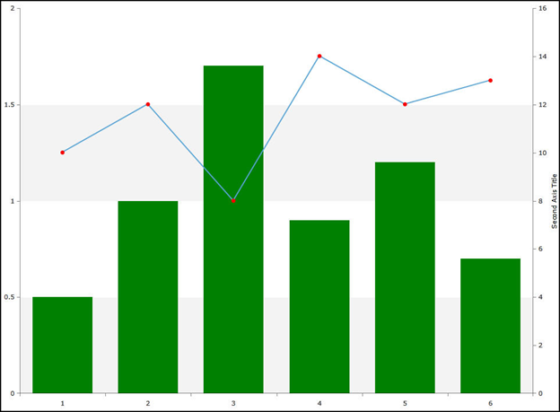

# RadChartView

This tutorial will introduce the RadChartView, part of the Telerik suite of XAML controls.  RadChartView is the our next generation chart offering that builds upon our experience with the general-purpose RadChart control.

We will show you how to get started with the two RadChartView charts: RadCartesianChart and RadPolarChart.

This tutorial covers the same material as [these videos](http://blogs.telerik.com/evanhutnick/posts/12-01-26/introducing-xamlflix---starting-with-radchartview-for-silverlight-and-wpf.aspx), where you can also download source code. 

## Setting Up The Project

To begin, open Visual Studio and click on the Telerik menu option.  Under *Rad Controls For Silverlight* click on *Create New Telerik Project*.  Name your project, accept Silverlight 5 and in the Silverlight Settings dialog check *Chart* (Controls and Data will be automatically selected as well).  Notice that the necessary assemblies have been added to the References as shown in figure 1

Figure 1

Your application will open to MainPage.xaml and, thanks to the Telerik Visual Studio extensions, the namespace *telerik* will already have been created in the XAML heading.    	

#### __XAML__

{{region xamlflix_chartview_0}}
	<UserControl x:Class="RadChartViewTutorial.MainPage"	
		xmlns="http://schemas.microsoft.com/winfx/2006/xaml/presentation" 
		xmlns:x="http://schemas.microsoft.com/winfx/2006/xaml"
		xmlns:d="http://schemas.microsoft.com/expression/blend/2008" 
		xmlns:mc="http://schemas.openxmlformats.org/markup-compatibility/2006"
		xmlns:telerik="http://schemas.telerik.com/2008/xaml/presentation"
		mc:Ignorable="d" d:DesignWidth="640" d:DesignHeight="480">
{{endregion}}

## Add A Cartesian Chart

To get started, add a RadCartesianChart to the grid:

#### __XAML__

{{region xamlflix_chartview_1}}
	<Grid x:Name="LayoutRoot">
		<telerik:RadCartesianChart>
		</telerik:RadCartesianChart>
	</Grid>
{{endregion}}

Notice that the designer tells you that the Horizontal and Vertical axes are not set.  This would be very important information if you were building the chart by hand, as we will later in this tutorial.    	

## Using the Chart Gallery

For now, however, rather than building it by hand we’ll click on the helper in the upper right hand corner of the designer, as shown in figure 2

Figure 2

Clicking on the helper opens the Chart Gallery, as shown in figure 3.

Figure 3

Here you can choose the type of chart you want to build.  We’ll build a Bar chart, selecting the horizontal multi-bar chart (note the red arrow I added to Figure 3).		

The chart helper drops a fully functional bar chart into your application.  You can run it as is, and you’ll have two sets of (hard-coded) data.  This is a great starting point to either add your own data or to remove the data and add it programmatically or through data binding.		

## Walking Through The Generated XAML

Let’s walk through the XAML that was created by the chart helper.

#### __XAML__

{{region xamlflix_chartview_2}}
	<telerik:RadCartesianChart.Grid>
		<telerik:CartesianChartGrid StripLinesVisibility="X">
			<telerik:CartesianChartGrid.XStripeBrushes>
				<SolidColorBrush Color="#FFD7D7D7" Opacity="0.3" />
				<SolidColorBrush Color="Transparent" />
			</telerik:CartesianChartGrid.XStripeBrushes>
		</telerik:CartesianChartGrid>
	</telerik:RadCartesianChart.Grid>
{{endregion}}

The first thing to notice is the RadCartesianChart.Grid which holds a CartesianChartGrid element. This element is used to set the StripLinesVisibility and the brush used with StripLines, and similar display options.

The next step is to set the vertical and horizontal axes

#### __XAML__

{{region xamlflix_chartview_3}}
	<telerik:RadCartesianChart.VerticalAxis>
		<telerik:CategoricalAxis />
	</telerik:RadCartesianChart.VerticalAxis>
	<telerik:RadCartesianChart.HorizontalAxis>
		<telerik:LinearAxis />
	</telerik:RadCartesianChart.HorizontalAxis>
{{endregion}}

Note that RadChartView does not have Bar and HorizontalBar series types; it has only one Bar type and the orientation is set by properly initializing RadCartesianChart.HorixontalAxis and the RadCartesianChart.VerticalAxis properties.  In this example, the vertical axis is set to show the categories, while the Horizontal axis is set to show linear values.  You have great freedom to include what you want in the chart view, including what the axes should show.  The types of Axes for a Cartesian Chart are shown in Table 1 

Axis	|	Description
---	|	---
Categorical	|	Arranges the data points where the key for the category is the point’s value
Date-time Categorical	|	Special categorical axis that expects each data point to provide a System.DateTime structure as its value for this axis
Linear	|	The coordinate of each data point depends on the numerical value of the point. If Minimum and Maximum properties are not set, the range is calculated.
Logarithmic	|	Special linear axis that will transform each data point value using the logarithm function. Used when there is a very large difference between the minimum and maximum values.
Date-time Continuous	|	Special axis that expects each data point to provide a System.DateTime structure as its value for this axis. Effectively a time-line.

Next comes the first of our Bar Series,

#### __XAML__

{{region xamlflix_chartview_4}}
	<telerik:BarSeries CombineMode="Cluster">
		<telerik:BarSeries.PointTemplate>
			<DataTemplate>
				<Rectangle Fill="#FF5AA4D4" />
			</DataTemplate>
		</telerik:BarSeries.PointTemplate>
	        <telerik:CategoricalDataPoint Category="1" Value="0.5" />
		<telerik:CategoricalDataPoint Category="2" Value="0.7" />
	</telerik:BarSeries>
{{endregion}}

The BarSeries element itself takes the CombineMode. Here we are using cluster, which places the bars side by side.  You may want to take a moment to play with the other options to see how they affect your chart. 		

We also override the PointTemplate to set the bar to be a Rectangle with a particular color (in this case, Blueish). 		

Finally, we set two data points, one each for the two categories.  Below this Bar Series is a second Bar Series that creates a dark orange bar with values again for categories 1 and 2, and values for both categories 1 and 2.		

The designer reflects these values.		

## Polar Charts

In addition to creating Cartesian charts, we can also create Polar charts.  The procedure is very similar. To see this, comment out the XAML for the Cartesian chart and add a new polar chart:

#### __XAML__

{{region xamlflix_chartview_5}}
	<telerik:RadPolarChart>
	            
	</telerik:RadPolarChart>
{{endregion}}

Once again you can use the gallery helper. This time you will see Polar and Radar Charts. Choose Polar Charts and then choose the area polar chart that I’ve indicated with a yellow arrow in figure 4,

Figure 4

Once again we can walk through the XAML.  As was true with the Cartesian chart, the first thing we notice is the Grid, but in this case it is providing GridLineVisibility as well as the RadialLineDashArray. 

#### __XAML__

{{region xamlflix_chartview_6}}
	<telerik:RadPolarChart>
		<telerik:RadPolarChart.Grid>
			<telerik:PolarChartGrid GridLineVisibility="Both" RadialLineDashArray="5,5" />
		</telerik:RadPolarChart.Grid>
{{endregion}}

With the Grid in place, the next step is to define the Radial and Polar Axis,

#### __XAML__

{{region xamlflix_chartview_7}}
	<telerik:RadPolarChart.RadialAxis>
		<telerik:NumericRadialAxis LineStroke="Transparent" MajorStep="90" />
	</telerik:RadPolarChart.RadialAxis>
	<telerik:RadPolarChart.PolarAxis>
		<telerik:PolarAxis LineStroke="Transparent" MajorStep="20" Maximum="100" />
	</telerik:RadPolarChart.PolarAxis>
{{endregion}}

Try changing the Major step on either axis and see the effect immediately in the designer.		

Next we set the color for the outline (stroke) and for the fill area, as well as the ellipses that are used to mark the data points.

#### __XAML__

{{region xamlflix_chartview_8}}
	<telerik:PolarAreaSeries Stroke="#FF5AA4D4">
		<telerik:PolarAreaSeries.PointTemplate>
			<DataTemplate>
				<Ellipse Fill="#FF5AA4D4" Height="10" Width="10" />
			</DataTemplate>
		</telerik:PolarAreaSeries.PointTemplate>
{{endregion}}

Finally, the values are hard coded to be drawn on the diagram,

#### __XAML__

{{region xamlflix_chartview_9}}
	<telerik:PolarDataPoint Value="35" />
	<telerik:PolarDataPoint Angle="30" Value="70" />
	<telerik:PolarDataPoint Angle="90" Value="70" />
	<telerik:PolarDataPoint Angle="135" Value="40" />
	<telerik:PolarDataPoint Angle="180" Value="60" />
	<telerik:PolarDataPoint Angle="225" Value="60" />
	<telerik:PolarDataPoint Angle="270" Value="35" />
	<telerik:PolarDataPoint Angle="320" Value="80" />
{{endregion}}

## Cartesian Chart in Depth

Let’s start with a new project, setting it up and including the libraries as above.  Next, we’ll add a Cartesian chart to the LayoutRoot, much as we did previously, 

#### __XAML__

{{region xamlflix_chartview_10}}
	<telerik:RadCartesianChart Name=�xCartesianChart�>
	    
	</telerik:RadCartesianChart>
{{endregion}}

This time however, rather than using the Gallery, we’ll hand tool our chart.  The first step is to add the grid. 

#### __XAML__

{{region xamlflix_chartview_11}}
	<telerik:RadCartesianChart.Grid>
	</telerik:RadCartesianChart.Grid>
{{endregion}}

Within this element the only element available is CartesianChartGrid, which we will add and which we’ll use to set the characteristics of the grid, such as the MajorLinesVisiblity, etc.,

#### __XAML__

{{region xamlflix_chartview_12}}
	<telerik:RadCartesianChart.Grid>
		<telerik:CartesianChartGrid MajorLinesVisibility="XY"
				MajorXLineDashArray="10,5"
				MajorXLinesRenderMode="All" />
	</telerik:RadCartesianChart.Grid>
{{endregion}}

The next step is to set up our axes. Intellisense is tremendously helpful here. Let’s begin by setting the vertical axis.

#### __XAML__

{{region xamlflix_chartview_13}}
	<telerik:RadCartesianChart.VerticalAxis>
		<telerik:LinearAxis />
	</telerik:RadCartesianChart.VerticalAxis
{{endregion}}

We’ll also set the horizontal axis to categorical (marking the categories for the chart),

#### __XAML__

{{region xamlflix_chartview_14}}
	<telerik:RadCartesianChart.HorizontalAxis>
		<telerik:CategoricalAxis />
	</telerik:RadCartesianChart.HorizontalAxis>	
{{endregion}}

The designer now informs us that we have no series. Intellisense will show us that we have a wide variety of series that we can choose from (BarSeries, AreaSeries, etc.).  We’ll choose SplineAreaSeries to create a spline chart.

#### __XAML__

{{region xamlflix_chartview_15}}
	<telerik:SplineAreaSeries CategoryBinding="XValue" ValueBinding="YValue" />
{{endregion}}

Note that we set the CategoryBinding to a property XValue and the ValueBinding to a property YValue. Let’s go to the code-behind and create these.      	

First thing to do is to create a class to represent the data,

#### __C#__

{{region xamlflix_chartview_16}}
	public class ChartDataClass
	{
		public double XValue { get; set; }
		public double YValue { get; set; }
	}
{{endregion}}

The action will take place in the page loaded event handler,

#### __C#__

{{region xamlflix-chartview_17}}
	void MainPage_Loaded(object sender, RoutedEventArgs e)
	{
	    var rnd = new Random();
	    var ChartDatas = new List<ChartDataClass>();
	
	    for (int i = 0; i < 20; i++)
	    {
	        var cdc = new ChartDataClass();
	        cdc.XValue = i;
	        cdc.YValue = rnd.NextDouble * 100;
	        ChartDatas.Add(cdc);
	    }
	
	}
{{endregion}}

We’ve created 20 values, where the x value counts from 1 to 20 and the YValue is a random double. We want these values to be the itemssource for the first series (and in this case, the only series) in the chart, 

#### __C#__

{{region xamlflix-chartview_18}}
	xCartesianChart.Series[0].ItemsSource = ChartDatas;
{{endregion}}

Let’s run the solution and see how our chart looks, you should see something that looks like the mountains of [Mordor](http://en.wikipedia.org/wiki/Mordor), as shown in figure 5.

Figure 5

## Pan And Zoom

If you modify the for loop in the previous example to count to 200 rather than to 20, you will get a very powerful overview, but the tick marks on the x axis will be unreadable and it won’t be possible to see a manageable number of points at any one time.		

To solve this problem, you can add a behavior for Zoom and Pan.  This is shockingly easy to do, and Intellisense will guide you through it.

#### __XAML__

{{region xamlflix_chartview_19}}
	<telerik:RadCartesianChart.Behaviors>
		<telerik:ChartPanAndZoomBehavior />
	</telerik:RadCartesianChart.Behaviors>
{{endregion}}

Run the application again and you’ll see that a horizontal scroll bar has been added to the bottom of the page.  You can use that to pan left and right, or you can grab a handle on one of the ends, and shorten the scroll bar and thus zoom into the details of the graph.		

In addition to zooming in with the zoom scroll bar, you can also mark part of your diagram using the mouse and the highlighted area will be zoomed to. Just click in the diagram, drag the highlight over the area you want to focus on, and let go; the highlighted area instantly fills the page.		

If you like, you can set the maximum zoom ratio.  You do this in the declaration of the Chart itself,	

#### __XAML__

{{region xamlflix_chartview_20}}
	<telerik:RadCartesianChart Name="xCartesianChart" MaxZoom="10,1">
{{endregion}}

Notice that MaxZoom takes two parameters; think of these as a ratio (e.g., 10:1). Given that there are 200 items in the chart, this will set the maximum zoom to show 20 items. 

You can also set the initial zoom level. You do this in the declaration of the chart as well, again using ratios, so you might write:

#### __XAML__

{{region xamlflix_chartview_21}}
	<telerik:RadCartesianChart Name="xCartesianChart" Zoom="10,1">
{{endregion}}

And the chart will open displaying the first 20 items.  You can of course also combine Zoom and MaxZoom in one statement,

#### __XAML__

{{region xamlflix_chartview_22}}
	<telerik:RadCartesianChart Name="xCartesianChart"  MaxZoom="10,1" Zoom="10,1">
{{endregion}}

## Track Ball Behavior

Track Ball Behavior allows you to display multiple axes and see precise information about any given category, as shown in figure 6  

Figure 6

To see this at work, let’s make a few changes to the previous example.  First, at the top of the XAML, where we define the Cartesian Chart, add a Palette,

#### __XAML__

{{region xamlflix_chartview_23}}
	<telerik:RadCartesianChart Name="xCartesianChart" Palette="Autumn">
{{endregion}}

Change the SplineAreaSeries to an AreaSeries, and then make a second AreaSeries,

#### __XAML__

{{region xamlflix_chartview_24}}
	<telerik:AreaSeries CategoryBinding="XValue" ValueBinding="YValue" />
	<telerik:AreaSeries CategoryBinding="XValue" ValueBinding="YValue" />
{{endregion}}

Now that you are ready to display a pair of series, you need to adjust the data creation in the code-behind.  Create two collections of ChartDataClass 

#### __C#__

{{region xamlflix-chartview_25}}
	var chartDatas = new List<ChartDataClass>();
	var chartDatas2 = new List<ChartDataClass>();
{{endregion}}

The for loop will create two instances of ChartDataClass for each iteration, and assign them appropriately, 

#### __C#__

{{region xamlflix-chartview_26}}
	for ( int i = 0; i < 200; i++ )
	{
	    var cdc = new ChartDataClass () ;
	    cdc.XValue = i;
	    cdc.YValue = rnd.NextDouble() * 100;
	    chartDatas.Add( cdc );
	
	    var cdc2 = new ChartDataClass();
	    cdc2.XValue = i;
	    cdc2.YValue = rnd.NextDouble() * 100;
	    chartDatas2.Add(cdc2);
	
	}
{{endregion}}

Finally, set the ItemsSource for each of the two series to each of the two collections,

#### __C#__

{{region xamlflix-chartview_27}}
	xCartesianChart.Series[0].ItemsSource = chartDatas;
	xCartesianChart.Series[1].ItemsSource = chartDatas2;
{{endregion}}

Run the application and you should see the two area series, but without the ability to run the mouse over the page and see the values at each intersection point.  To accomplish that, you’ll need to add a second behavior,

#### __XAML__

{{region xamlflix_chartview_28}}
	<telerik:RadCartesianChart.Behaviors>
	    <telerik:ChartTrackBallBehavior 
	         ShowIntersectionPoints="True"
	         ShowTrackInfo="True"
	         SnapMode="AllClosePoints"/>
	    <telerik:ChartPanAndZoomBehavior  />
	</telerik:RadCartesianChart.Behaviors>
{{endregion}}

Note that this second behavior takes a number of attributes to determine how the two graphs are compared and how points are selected.      	

## Customizing the TrackBall Display

It may be that you do not want to display the category or value in the default way.  It turns out to be easy to customize the display.  To see this, scroll down the XAML to the first AreaDisplay and change it to a non-self-closing tag,

#### __XAML__

{{region xamlflix_chartview_29}}
	<telerik:AreaSeries CategoryBinding="XValue" ValueBinding="YValue" >
	
	</telerik:AreaSeries>
{{endregion}}

Within these tags, place a AreaSeries.TrackBallInfoTemplate, which in turn takes a DataTemplate

#### __XAML__

{{region xamlflix_chartview_30}}
	<telerik:AreaSeries CategoryBinding="XValue" ValueBinding="YValue" >
	     <telerik:AreaSeries.TrackBallInfoTemplate>
	         <DataTemplate>
	         </DataTemplate>
	     </telerik:AreaSeries.TrackBallInfoTemplate>
	 </telerik:AreaSeries>
{{endregion}}

Within the DataTemplate you can put whatever you want to display whatever data you like. As a simple example, we can add a TextBlock, set the color to Red and have it display the category,

#### __XAML__

{{region xamlflix_chartview_31}}
	<telerik:AreaSeries CategoryBinding="XValue" ValueBinding="YValue" >
	     <telerik:AreaSeries.TrackBallInfoTemplate>
	         <DataTemplate>
	             <TextBlock Foreground="Red" Text="{Binding DataPoint.Category}" />
	         </DataTemplate>
	     </telerik:AreaSeries.TrackBallInfoTemplate>
	 </telerik:AreaSeries>
{{endregion}}

When you run the application now, the first series is displayed with the custom display, the second series is displayed with the default display.

## SelectionBehavior

To see SelectionBehavior at work, let’s create a new application and populate it with a simple scatter diagram,

#### __XAML__

{{region xamlflix_chartview_32}}
	<telerik:RadCartesianChart x:Name="RadChart1" Palette="Metro" >
	
	     <telerik:ScatterPointSeries />
	
	     <telerik:RadCartesianChart.HorizontalAxis>
	         <telerik:LinearAxis />
	     </telerik:RadCartesianChart.HorizontalAxis>
	     <telerik:RadCartesianChart.VerticalAxis>
	         <telerik:LinearAxis />
	     </telerik:RadCartesianChart.VerticalAxis>
	
	 </telerik:RadCartesianChart>
{{endregion}}

Note that our ScatterPointSeries has a LinearAxis on both the x and y axis.  We have not set the X and Y value binding because this time we will do so programmatically (in code).  We do want to add the selection behavior, however,

#### __XAML__

{{region xamlflix_chartview_33}}
	<telerik:RadCartesianChart.Behaviors>
	    <telerik:ChartSelectionBehavior DataPointSelectionMode="Single" />
	</telerik:RadCartesianChart.Behaviors>
{{endregion}}

In this case, we’ve set the DataPointSelectionMode to Single rather than Multiple; that is, we’ll be selecting just one data point at a time.

Let’s turn to the code behind.  The first thing we need is a ChartData class,

#### __C#__

{{region xamlflix-chartview_34}}
	public class ChartData
	{
		public double XValue { get;set; }
	
		public double YValue { get;set; }
	}
{{endregion}}

With that in place we can create a method to generate the data for the diagram,

#### __C#__

{{region xamlflix-chartview_35}}
	private List<ChartData> GetData()
	{
	    var rand = new Random () ;
	    var data = new List<ChartData> () ;
	
	    for ( int i = 1; i < 30; i++ )
	    {
	        data.Add( new ChartData () { XValue = i, YValue = rand.Next( 10, 100 ) } );
	    }
	
	    return data;
	}
{{endregion}}

Finally, we are ready to return to the constructor, and to set the X and YValue Databinding and to set the datasource,

#### __C#__

{{region xamlflix-chartview_36}}
	public MainPage()
	{
	    InitializeComponent();
	    var series = RadChart1.Series[ 0 ] as ScatterPointSeries;
	    series.XValueBinding = new PropertyNameDataPointBinding ( "XValue" ) ;
	    series.YValueBinding = new PropertyNameDataPointBinding ( "YValue" ) ;
	    series.ItemsSource = this.GetData();
	}
{{endregion}}

We need to wire up the SelectionChanged event handler,

#### __C#__

{{region xamlflix-chartview_37}}
	private void RadChart1_SelectionChanged(object sender, ChartSelectionChangedEventArgs e)
	{
	    if (e.AddedPoints.Count == 0)
	        return;
	
	    // Get the data point.
	    var dataPoint = e.AddedPoints[0];
	
	    // Get the series.
	    var series = dataPoint.Presenter as ScatterPointSeries;
	}
{{endregion}}

As elements are selected, we want their color to change. For this, we’ll use the Selection Palette.

#### __XAML__

{{region xamlflix_chartview_38}}
	<telerik:RadCartesianChart.SelectionPalette>
	    <telerik:ChartPalette>
	        <telerik:ChartPalette.GlobalEntries>
	            <telerik:PaletteEntry Fill="Red" />
	        </telerik:ChartPalette.GlobalEntries>
	    </telerik:ChartPalette>
	</telerik:RadCartesianChart.SelectionPalette>
{{endregion}}

When you run the application and click on a data point, it turns red, as shown in figure 7

Figure 7

## Multi-Axes Charts

Another new feature in RadChartView is the ability to create multi-axes charts, as shown in figure 8,

Figure 8

Notice that there is an axis for the bar chart on the left (0-2) and an axis for the line chart on the right (0-16).  This allows for the comparison of correlated but disparate data. For example, the bars might show the amount spent on Marketing (in thousands of dollars) for six months, while the line chart might show sales (in units) for the same six months.      	

Creating a multi-axis chart is straight forward. To get started, create a new application and add a Bar Chart to the application as described at the start of this tutorial.  Immediately below the closing tag for the BarSeries, place an opening tag for your LineSeries.  Add a VerticalAxis element and within that a Linear Axis element.  The latter can hold the title for your second axis, and, critically, the HorizontalLocation which you will set to “Right” – causing this second axis to appear on the right side of the chart,

#### __XAML__

{{region xamlflix_chartview_39}}
	<telerik:LineSeries>
	    <telerik:LineSeries.VerticalAxis>
	        <telerik:LinearAxis Title="Second Axis Title" HorizontalLocation="Right" />
	    </telerik:LineSeries.VerticalAxis>
{{endregion}}

For this example, I also set the ellipses that represent the data points to red,

#### __XAML__

{{region xamlflix_chartview_40}}
	<telerik:LineSeries.PointTemplate>
	    <DataTemplate>
	        <Ellipse Height="7" Width="7" Fill="Red" />
	    </DataTemplate>
{{endregion}}

Finally, I hard-coded some data for the line chart,

#### __XAML__

{{region xamlflix_chartview_41}}
	<telerik:CategoricalDataPoint Value="10" />
	<telerik:CategoricalDataPoint Value="12" />
	<telerik:CategoricalDataPoint Value="8" />
	<telerik:CategoricalDataPoint Value="14" />
	<telerik:CategoricalDataPoint Value="12" />
	<telerik:CategoricalDataPoint Value="13" />
{{endregion}}

That’s all it takes to create a multi-axes chart.

## Summary

In this tutorial you’ve seen how to create charts using the Chart Gallery and how to create them by hand. You’ve looked at both Cartesian and Polar Charts, and you’ve seen how to tailor the background, graph lines, colors and so forth to meet your needs.  In addition, you’ve seen how to use behaviors to add Pan and Zoom with just a few lines of XAML, and similarly how to add TrackBall behavior and Selection Behavior.  Finally, you saw how to create a MultiAxes chart.   	
