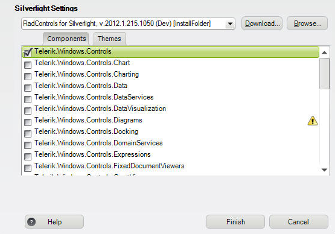
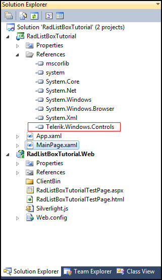
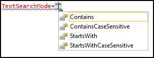

# RadListBox

This tutorial will introduce the __RadListBox__ control, part of the Telerik suite of XAML controls.

## Setting Up The Project

To begin, open Visual Studio and click on the Telerik menu option.  Under *RadControls For Silverlight* click on *Create New Telerik Project*.  Name your project, accept Silverlight 5 and in the *Project Configuration Wizard* dialog check Controls, as shown in figure 1.

Figure 1

When you click ok, the necessary assembly is added to the References as shown in figure 2

Figure 2

Your application will open to MainPage.xaml and, thanks to the Telerik Visual Studio extensions, the namespace __telerik__ will already have been created in the XAML heading.

#### __XAML__
{{region xamlflix-listbox-0}}
	<UserControl x:Class="RadBarCode.GettingStarted.MainPage"
			xmlns="http://schemas.microsoft.com/winfx/2006/xaml/presentation" 
			xmlns:x="http://schemas.microsoft.com/winfx/2006/xaml"
			xmlns:d="http://schemas.microsoft.com/expression/blend/2008" 
			xmlns:mc="http://schemas.openxmlformats.org/markup-compatibility/2006"
			xmlns:telerik="http://schemas.telerik.com/2008/xaml/presentation"
			mc:Ignorable="d" d:DesignWidth="640" d:DesignHeight="480">
{{endregion}}
			
We need some data to work with. We’ll create an Employee class to represent (surprise!) employees of a company.

#### __C#__
{{region xamlflix-listbox-1}}
	public class Employee
	{
		public string PathData { get; set; }
		public string FirstName { get; set; }
		public string LastName { get; set; }
	}
{{endregion}}

The PathData holds a path to an avatar for the Employee.  We also need an EmployeeService to generate a set of Employee instances (we recommend you download this from the associated source code).  Here’s an excerpt from the service,
	
#### __C#__
{{region xamlflix-listbox-2}}
    public class EmployeeService
    {
        public static ObservableCollection<Employee> GetEmployees()
        {
            ObservableCollection<Employee> employees = new ObservableCollection<Employee>();
            Employee employee = new Employee();
            employee.PathData = "M9.4136295,2.4576555E-05 C14.800209,-0.013108866 21.555286,5.2417045 22.176739,5.7343717 L22.197632,5.7509871 L22.217262,5.7353773 C22.838715,5.2427092 29.593792,-0.012109431 34.98037,0.0010241366 C35.357132,0.0019429834 35.727203,0.028634096 36.088013,0.084530063 C42.004845,1.0011631 47.504379,6.5009952 42.3377,16.251131 C37.251743,25.848923 27.320799,36.495747 22.4014,37.30304 L22.224001,37.326874 L22.224001,37.333 L22.22303,37.332958 L22.200874,37.329983 L22.170971,37.334 L22.170465,37.325897 L21.992601,37.301998 C17.073202,36.494705 7.1422567,25.847895 2.056303,16.250114 C-3.1103802,6.4999881 2.3891582,1.0001625 8.3059864,0.083530508 C8.6667957,0.027634615 9.0368671,0.00094353169 9.4136295,2.4576555E-05 z";
            employee.FirstName = "Maria";
            employee.LastName = "Anders";
            employees.Add(employee);
            employee = new Employee();
            employee.PathData = "M15.647604,0 L15.722293,0.2259102 L15.796986,0 L19.52689,11.467036 L31.44397,11.467036 L21.802914,18.464333 L25.560999,30.018 L15.722294,22.877533 L5.8839722,30.018 L9.641818,18.464611 L0,11.467036 L11.917845,11.467036 z";
            employee.FirstName = "Ana";
            employee.LastName = "Trujillo";
            employees.Add(employee);
{{endregion}}

Switching to MainPage.xaml we want to layout how we’re going to display the items in the listBox.  For that we’ll need to add an ItemTemplate with a DataTemplate inside it.

#### __XAML__
{{region xamlflix-listbox-3}}
	<telerik:RadListBox Name="xRadListBox" Margin="50" >
		<telerik:RadListBox.ItemTemplate>
			<DataTemplate>
			</DataTemplate>
		</telerik:RadListBox.ItemTemplate>
	</telerik:RadListBox>
{{endregion}}

Inside the DataTemplate we’ll create a Grid with two columns, in the ratio of 1:4
	
#### __XAML__
{{region xamlflix-listbox-4}}
	<Grid>
		<Grid.ColumnDefinitions>
			<ColumnDefinition Width="1*" />
			<ColumnDefinition Width="4*" />
		</Grid.ColumnDefinitions>
{{endregion}}

The first item in the Grid is the Path, which will be in column 0,

#### __XAML__
{{region xamlflix-listbox-5}}
	<Path Data="{Binding PathData}" Fill="Red" Width="50" Height="50" Margin="10" HorizontalAlignment="Center" />
{{endregion}}

The second item in the Grid is a stack panel in column 1 that holds the first and last name.

#### __XAML__
{{region xamlflix-listbox-6}}
	<StackPanel Grid.Column="1">
		<TextBlock Text="{Binding FirstName}" />
		<TextBlock Text="{Binding LastName}"/>
	</StackPanel>
{{endregion}}

The binding needs a data source. Since this is a list box, we can accomplish that by assigning a collection to the ItemsSource property, which we’ll do in the Loaded event handler in the code-behind,

#### __C#__
{{region xamlflix-listbox-7}}
	public MainPage()
	 {
		 InitializeComponent();
		 Loaded += new RoutedEventHandler(MainPage_Loaded);
	 }

	 void MainPage_Loaded(object sender, RoutedEventArgs e)
	 {
		 xRadListBox.ItemsSource = EmployeeService.GetEmployees();
	 }
{{endregion}}
	 
The result is a list box with two columns: icon on the left and name on the right, as shown in figure 3,

Figure 3

## Searching and Selecting

Return to the example shown above, but remove the ItemTemplate entirely and instead, add a DisplayMemberPath attribute, 

#### __XAML__
{{region xamlflix-listbox-8}}
	<telerik:RadListBox DisplayMemberPath="FirstName" Name="xRadListBox" Margin="50" />
{{endregion}}

If you run the application now, the list box will be filled with the first name of all 15 of the items generated by the Employee service.

To enable searching, you’ll need to modify the RadListBox declaration by adding

#### __XAML__
{{region xamlflix-listbox-9}}
	IsTextSearchEnabled="True"
{{endregion}}
	
And setting the TextSearchMode as shown in figure 4

Figure 4

Assuming we choose StartsWith, when looking at the __RadListBox__ you can begin typing and the selection will jump to the first matching entry. As you type you can narrow down to the entry you have in mind.

To control whether the user can select only a single value or multiple values, you can set the SelectionMode, as shown in figure 5,

Figure 5

Assuming you choose Multiple, the user can control-select multiple items, as shown in figure 6,

Figure 6
