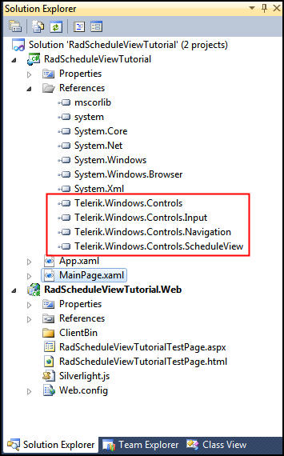
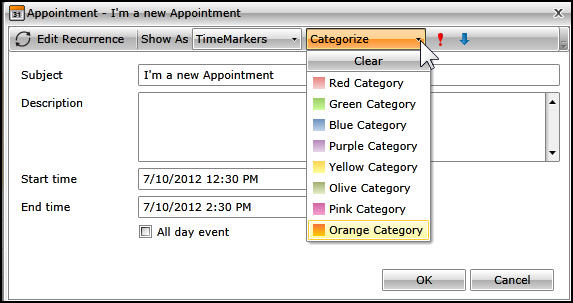
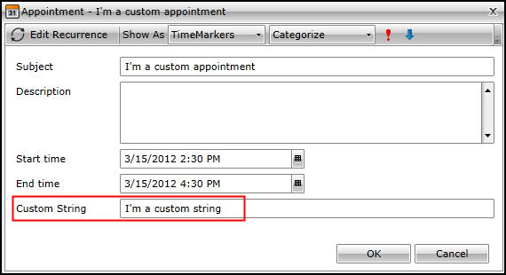
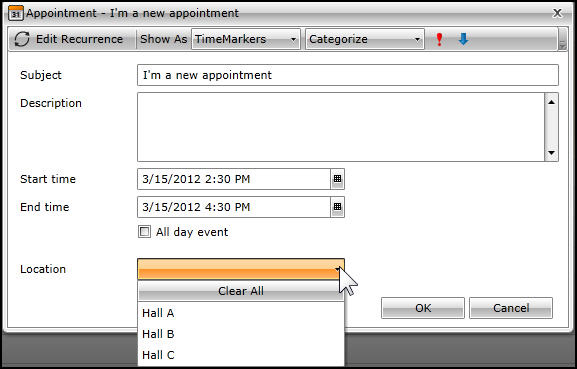
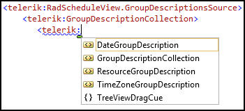
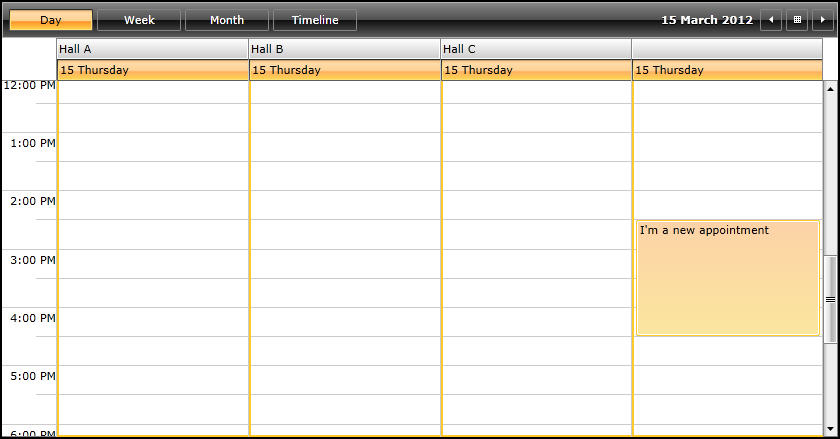
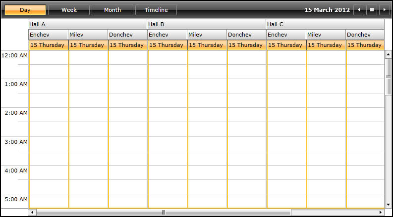
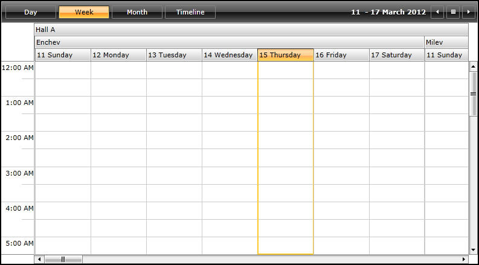
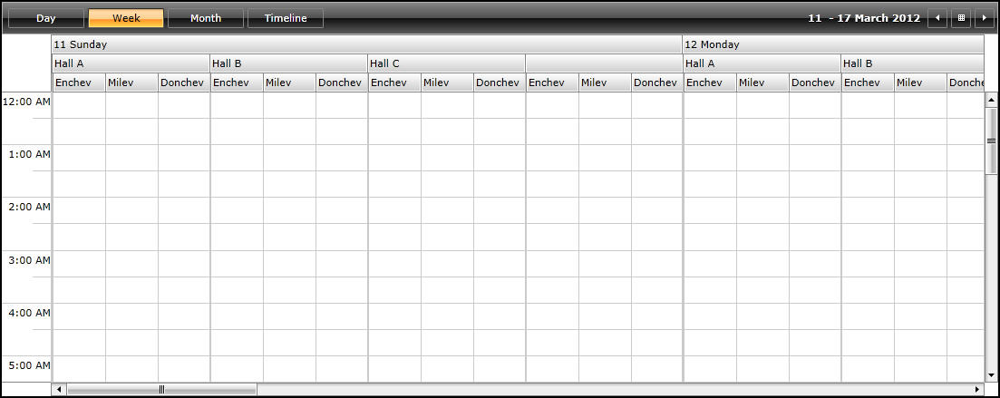

# RadScheduleView

This tutorial will introduce the RadScheduleView, part of the Telerik suite of XAML controls.   

## Setting Up The Project

To begin, open Visual Studio and click on the Telerik menu option.  Under Rad Controls For Silverlight click on Create New Telerik Project.  Name your project, accept Silverlight 5 and in the Silverlight Settings dialog check ScheduleView (notice that the dependent references are automatically checked as well).  When you click ok, the necessary assemblies are added to the References as shown in figure 1.

             Figure 1
          

Your application will open to MainPage.xaml and, thanks to the Telerik Visual Studio extensions, the namespace telerik will already have been created in the XAML heading.
        

#### __XAML__

{{region xamlflix_scheduleview_0}}
	<UserControl x:Class="RadScheduleViewTutorial.MainPage"
			xmlns="http://schemas.microsoft.com/winfx/2006/xaml/presentation" 
			xmlns:x="http://schemas.microsoft.com/winfx/2006/xaml"
			xmlns:d="http://schemas.microsoft.com/expression/blend/2008" 
			xmlns:mc="http://schemas.openxmlformats.org/markup-compatibility/2006"
			xmlns:telerik="http://schemas.telerik.com/2008/xaml/presentation"
			mc:Ignorable="d" d:DesignWidth="640" d:DesignHeight="480">
	
	{{endregion}}

The simplest way to get started is to drag a ScheduleView onto the design surface, but to make sure we fully understand what goes into creating a RadScheduleView, we’ll build it up line by line in the XAML.
        

#### __XAML__

{{region xamlflix_scheduleview_1}}
	<telerik:RadScheduleView Name="xRadScheduleView" >   
	</telerik:RadScheduleView>
	
	{{endregion}}

As soon as you add the above code, you’ll see that the designer says Please Provide an AppointmentsSource.  This is something that you can do through binding or via code in the code behind. While we are fans of MVVM (and binding to a View Model object) for this example we’ll keep things simple and use code-behind.
          The first thing we want to do is add some view definitions.
        

#### __XAML__

{{region xamlflix_scheduleview_2}}
	<telerik:RadScheduleView Name="xRadScheduleView" >
	    <telerik:RadScheduleView.ViewDefinitions>    
	    </telerik:RadScheduleView.ViewDefinitions>
	</telerik:RadScheduleView>
	{{endregion}}

Within the ViewDefinitions collection there are various definitions you can add, as shown by Intellisense, as seen in figure 2,
        

             Figure 2
          

We still need an appointments source,  however; so we’ll save the XAML and jump into the code behind (MainPage.xaml.cs)
          In the PageLoaded event handler, we’ll create an observable collection of Appointment objects,
        

#### __C#__

{{region xamlflix_scheduleview_30}}
	    void MainPage_Loaded(object sender, RoutedEventArgs e)
	{
	    var appointments = new ObservableCollection<Appointment>();
	
	Lets add one new appointment to the collection
	appointments.Add(new Appointment()
	 {
	     Subject = "I'm a new Appointment",
	     Start = new DateTime(2012, 7, 10, 12, 30, 00),
	     End = new DateTime(2012, 7, 10, 14, 30, 00)
	
	
	 });
	
	{{endregion}}

Let’s add one new appointment to the collection
        

#### __C#__

{{region xamlflix_scheduleview_32}}
	appointments.Add(new Appointment()
	 {
	     Subject = "I'm a new Appointment",
	     Start = new DateTime(2012, 7, 10, 12, 30, 00),
	     End = new DateTime(2012, 7, 10, 14, 30, 00)
	
	
	 });
	
	{{endregion}}

Finally, we need to set the AppointmentsSource (note, this is a specialized form of ItemsSource) to our collection,
          xRadScheduleView.AppointmentsSource = appointments;
          Here’s the complete source code for the code-behind page for context,
        

#### __C#__

{{region xamlflix_scheduleview_34}}
	using System.Windows;
	using System.Windows.Controls;
	using Telerik.Windows.Controls.ScheduleView;
	
	namespace RadScheduleViewTutorial
	{
	    public partial class MainPage : UserControl
	    {
	        public MainPage()
	        {
	            InitializeComponent();
	            Loaded += new RoutedEventHandler(MainPage_Loaded);
	        }
	
	        void MainPage_Loaded(object sender, RoutedEventArgs e)
	        {
	            var appointments = new ObservableCollection<Appointment>();
	            appointments.Add(new Appointment()
	            {
	                Subject = "I'm a new Appointment",
	                Start = new DateTime(2012, 7, 10, 12, 30, 00),
	                End = new DateTime(2012, 7, 10, 14, 30, 00)
	            });
	
	            xRadScheduleView.AppointmentsSource = appointments;
	        }
	    }
	}
	
	{{endregion}}

Run the application and note that the appointment for July 10 2012 runs from our start time to our end time. Once you locate the appointment, double click on it to see the details.  Note the drop down choices across the top of the dialog box as well, as shown in figure 3,
        

             Figure 3
          

While you are in the ScheduleView, you can double-click to create a new appointment, entering all the details in the details dialog.
          Notice also that you can open month view and just drag and drop an appointment from one day to another to reschedule, and you can click on the x mark (shown when you hover over the appointment) to delete it.
        

## Custom Appointments

To take a look at custom appointments, let’s create a new project, and this time drag a RadScheduleView onto the canvas.  Go to the XAML and remove the alignments and the margin.
          Click on the project, and then Add->Class.  Name your new class Custom Appointment.  This custom class derives from Appointment. We’ll add just one property to that class,
        

#### __C#__

{{region xamlflix_scheduleview_36}}
	public class CustomAppointment : Appointment
	{
	    public string customString;
	    public string CustomString
	    {
	        get                        
	        {
	            return customString;
	        }
	        set
	        {
	        	if ( customString != value)
	            {
	                customString = value;
	                OnPropertyChanged( () => this.customString );
	            }
	        }
	    }
	}
	{{endregion}}

Note the type safe call to OnPropertyChanged. This is enabled by a Telerik base class.
          In the same class, you’ll need to override both Copy and CopyFrom.
        

#### __C#__

{{region xamlflix_scheduleview_38}}
	public override IAppointment Copy()
	{
	    return base.Copy();
	}
	
	public override void CopyFrom(IAppointment other)
	{
	    base.CopyFrom(other);
	}
	
	{{endregion}}

Implement Copy to make a new instance of the Appointment,
        

#### __C#__

{{region xamlflix_scheduleview_40}}
	public override IAppointment Copy()
	{
	    var customAppointment = new CustomAppointment () ;
	    customAppointment.CopyFrom( this );
	    return customAppointment;
	}
	
	{{endregion}}

It is the override of CopyFrom that handles copying our custom string,
        

#### __C#__

{{region xamlflix_scheduleview_42}}
	public override void CopyFrom(IAppointment other)
	 {
	     var customAppointment = other as CustomAppointment;
	     if ( customAppointment != null )
	     {
	         this.CustomString = customAppointment.CustomString;
	     }
	     base.CopyFrom( other );
	 }
	{{endregion}}

We need also to ensure that the IEditableObject interface is supported by our custom string so that we can cancel or revert an appointment.  This involves modifications to the Property,
        

#### __C#__

{{region xamlflix_scheduleview_44}}
	public string CustomString
	 {
	     get                        
	     {
	       return  this.Storage<CustomAppointment>().customString;
	     }
	     set
	     {
	         var storage = this.Storage<CustomAppointment>();
	
	     	if ( storage.customString != value)
	         {
	             storage.customString = value;
	             OnPropertyChanged( () => this.customString );
	         }
	     }
	 }
	{{endregion}}

If the user makes a number of changes to an appointment and then hits cancel, this allows the system to roll back all the changes, including those to our custom string.
          The heavy lifting is done in the Loaded event handler, where we create a new observable collection of CustomAppointment objects, and then instantiate one new Custom Appointment and add it to the list.  Finally, we set that list as the Appointments Source for our RadScheduleView,
        

#### __C#__

{{region xamlflix_scheduleview_46}}
	void MainPage_Loaded(object sender, RoutedEventArgs e)
	{
	    var appointments = new ObservableCollection<CustomAppointment>();
	    appointments.Add(new CustomAppointment()
	    {
	        Subject = "I'm a custom appointment",
	        Start = new DateTime(2012, 3, 15, 14, 30, 00),
	        End = new DateTime(2012, 3, 15, 16, 30, 00),
	        CustomString = "I'm a custom string"
	
	    });
	
	    radScheduleView1.AppointmentsSource = appointments;
	
	}
	
	{{endregion}}

If you run this, everything works as expected, except that there is no way to see our new custom string.  This is because the template for the dialog box does not include a place for the custom string.
          To do this we want to add the template to our project.  You can find the file you need at C:\Program Files (x86)\Telerik\RadControls for Silverlight Q1 2012\Themes\OfficeBlack\Themes\Office\Black (OfficeBlack is the default theme) The file is named  ScheduleView.xaml.  Add that file to the project.
        

>Note, depending on your version, the path may be slightly different (e.g., RadControls For Silverlight Q2 2012, etc.)

Double click to open the file and hit control-F to find the string editAppointment.  Skip down to the line that looks like this:
        

#### __XAML__

{{region xamlflix_scheduleview_3}}
	<ControlTemplate x:Key="EditAppointmentTemplate" TargetType="local:SchedulerDialog">
	{{endregion}}

Search again, this time for AllDayEventCheckBox.  Let’s steal this row for our custom field.
          After commenting out the two lines for the CheckBox, add lines for a TextBlock prompt and a TextBox to receive the data.
        

#### __XAML__

{{region xamlflix_scheduleview_4}}
	<TextBlock Grid.Row="4" Grid.Column="0" Margin="6" Text="Custom String" />
	{{endregion}}

The TextBox is a bit more complex, but if you scroll up to the Subject TextBox you’ll see that we’ve just cut and pasted and then adjusted the rows and the specific field,
        

#### __XAML__

{{region xamlflix_scheduleview_5}}
	<TextBox Grid.Row="4" Grid.Column="1"  Grid.ColumnSpan="2" Margin="3"
	     Text="{Binding Occurrence.Appointment.CustomString, 
	     ValidatesOnDataErrors=True, 
	     NotifyOnValidationError=True, 
	     Mode=TwoWay}" />
	
	{{endregion}}

Scroll down just a bit more to the EditAppointmentDialogStyle and copy that name to the clipboard.  Return to the main page where the RadScheduleView is defined and add the Dialog Style,
        

#### __XAML__

{{region xamlflix_scheduleview_6}}
	<telerik:RadScheduleView Name="radScheduleView1"
	EditAppointmentDialogStyle="{StaticResource EditAppointmentDialogStyle}">
	
	{{endregion}}

This picks up the template we just modified.  Save all the files. Before we can run, however, we need to make the resource dictionary available.  Go into App.xaml and inside the Application Resources element,
        

#### __XAML__

{{region xamlflix_scheduleview_7}}
	<Application.Resources>
	    <ResourceDictionary>
	        <ResourceDictionary.MergedDictionaries>
	            <ResourceDictionary Source="ScheduleView.xaml" />
	        </ResourceDictionary.MergedDictionaries>
	    </ResourceDictionary>
	</Application.Resources>
	
	{{endregion}}

If you run the application and double click on the custom appointment, you’ll see that the dialog box now shows the custom string that we added, as shown circled in figure 4,
        

             Figure 4
          

## Adding Resources To Appointments

It is common to want to associate a resource (a room, a projector, etc.) with an appointment.  You may have limited resources, and in any case you do not want one specific resource assigned to two simultaneous appointments.
          To see how to do this with the RadScheduleView let’s start a new application.
          Drag a RadScheduleView onto the design surface, and remove the alignments and the margin.  Open MainPage.xaml.cs and add a Loaded event handler similar to the ones seen above,
        

#### __C#__

{{region xamlflix_scheduleview_48}}
	void MainPage_Loaded(object sender, RoutedEventArgs e)
	{
	    var appointments = new ObservableCollection<Appointment>();
	    appointments.Add(new Appointment()
	    {
	        Subject = "I'm a new appointment",
	        Start = new DateTime(2012, 3, 15, 14, 30, 00),
	        End = new DateTime(2012, 3, 15, 16, 30, 00),
	    });
	
	    radScheduleView1.AppointmentsSource = appointments;
	
	}
	{{endregion}}

To begin defining the resource, return to the Xaml and add the following to the RadScheduleView definition,
        

#### __XAML__

{{region xamlflix_scheduleview_8}}
	            <telerik:RadScheduleView.ResourceTypesSource>
	                <telerik:ResourceTypeCollection>
	                    
	                </telerik:ResourceTypeCollection>
	            </telerik:RadScheduleView.ResourceTypesSource>
	
	{{endregion}}

Within the ResourceTypeCollection add a ResourceType
        

#### __XAML__

{{region xamlflix_scheduleview_9}}
	<telerik:ResourceType DisplayName="Location" Name="Location">
	{{endregion}}

One option is to add AllowMultipleSelection, however as the resource we’re tracking in this example is a location, we will not add that attribute as you can’t be in two places at once.
          Within the ResourceType we’ll define three resources, Hall A, Hall B and Hall C.   The critical attributes are the DisplayName and the ResourceType (in this case, Location).
          For context, here is the complete definition from the XAML,
        

#### __XAML__

{{region xamlflix_scheduleview_10}}
	<telerik:RadScheduleView Name="radScheduleView1" >
	    <telerik:RadScheduleView.ViewDefinitions>
	        <telerik:DayViewDefinition />
	        <telerik:WeekViewDefinition />
	        <telerik:MonthViewDefinition />
	        <telerik:TimelineViewDefinition />
	    </telerik:RadScheduleView.ViewDefinitions>
	    <telerik:RadScheduleView.ResourceTypesSource>
	        <telerik:ResourceTypeCollection>
	            <telerik:ResourceType DisplayName="Location" Name="Location">
	                <telerik:Resource ResourceName="Hall A" ResourceType="Location" />
	                <telerik:Resource ResourceName="Hall B" ResourceType="Location" />
	                <telerik:Resource ResourceName="Hall C" ResourceType="Location" />
	            </telerik:ResourceType>
	        </telerik:ResourceTypeCollection>
	    </telerik:RadScheduleView.ResourceTypesSource>
	</telerik:RadScheduleView>
	
	{{endregion}}

Run the application, and double click on the appointment we hard-wired in MainPage.xaml.cs.  Notice that there is now a Location drop-down. Click on it and you’ll see the mutually exclusive choices of the three Halls, as shown in figure 5.
        

             Figure 5
          

## 
        Grouping Resources
      

To get started, let’s expand on the  previous example by adding additional resources.
        

#### __XAML__

{{region xamlflix_scheduleview_11}}
	<telerik:ResourceType DisplayName="Speaker" Name="Speaker">
	    <telerik:Resource ResourceName="Enchev" ResourceType="Speaker" />
	    <telerik:Resource ResourceName="Milev" ResourceType="Speaker" />
	    <telerik:Resource ResourceName="Donchev" ResourceType="Speaker" />
	</telerik:ResourceType>
	
	{{endregion}}

If you run the application now, you’ll see that you can pick a hall and you can pick a speaker for each appointment.  We would like, however, to be able to see how our resources are allocated without having to review every appointment.
          To do this, we’ll add a new element below the ResourceTypeSource: GroupDescriptionSource, and within that GroupDescriptionCollection, inside of which we can define ResourceGroupDescriptions as shown in figure 6,
        

             Figure 6
          

We’ll choose ResourceGroupDescription and set the ResourceType to Location. Once again, for context, here is the complete definition,
        

#### __XAML__

{{region xamlflix_scheduleview_12}}
	<telerik:RadScheduleView Name="radScheduleView1" >
	    <telerik:RadScheduleView.ViewDefinitions>
	        <telerik:DayViewDefinition />
	        <telerik:WeekViewDefinition />
	        <telerik:MonthViewDefinition />
	        <telerik:TimelineViewDefinition />
	    </telerik:RadScheduleView.ViewDefinitions>
	    <telerik:RadScheduleView.ResourceTypesSource>
	        <telerik:ResourceTypeCollection>
	            <telerik:ResourceType DisplayName="Location" Name="Location">
	                <telerik:Resource ResourceName="Hall A" ResourceType="Location" />
	                <telerik:Resource ResourceName="Hall B" ResourceType="Location" />
	                <telerik:Resource ResourceName="Hall C" ResourceType="Location" />
	            </telerik:ResourceType>
	            <telerik:ResourceType DisplayName="Speaker" Name="Speaker">
	                <telerik:Resource ResourceName="Enchev" ResourceType="Speaker" />
	                <telerik:Resource ResourceName="Milev" ResourceType="Speaker" />
	                <telerik:Resource ResourceName="Donchev" ResourceType="Speaker" />
	            </telerik:ResourceType>
	        </telerik:ResourceTypeCollection>
	    </telerik:RadScheduleView.ResourceTypesSource>
	    <telerik:RadScheduleView.GroupDescriptionsSource>
	        <telerik:GroupDescriptionCollection>
	            <telerik:ResourceGroupDescription ResourceType="Location" />
	        </telerik:GroupDescriptionCollection>
	    </telerik:RadScheduleView.GroupDescriptionsSource>
	</telerik:RadScheduleView>
	
	{{endregion}}

If you were to run the program now you would not see the appointment, because we are not showing appointments that don’t have a resource set.  This is fixed by returning to the ResourceGroupDescription and adding the attribute ShowNullGroup=”True.”
          If you run the application now, you’ll find appointments grouped by Location and the last column will be the null group, that is the group that are not yet assigned a location, as shown in figure 7,
        

             Figure 7
          

Note that you are now free to set the Hall in this location either from the drop down, or just by dragging it into the column you want.
          You can now add a second grouping,
        

#### __XAML__

{{region xamlflix_scheduleview_13}}
	 <telerik:ResourceGroupDescription ResourceType="Speaker" />
	{{endregion}}

And when you run the application you’ll see that the appointment “slots” are grouped first by hall and then by speaker, as shown in Figure 8,
        

             Figure 8
          

If you scroll to the far right you’ll find the null hall group with each of the three speakers. We don’t have a column for no speaker selected as we did not set ShowNullGroup = “True” for the speakers.
          If you create a new appointment under Hall A Enchev, that will be reflected in the drop down for the resources in the Appointment dialog.  If you then drag and drop that same appointment into Hall B for Milev, both resources will be changed in the Appointment dialog.
          If you switch to the week view, however, you’ll find that the schedule becomes cumbersome to work with, as shown in figure 9,
        

             Figure 9
          

Setting the right hall with the right speaker on the right date is less than obvious (note that this view scrolls dramatically to the right to accommodate each hall and each speaker for each week.)   You can fix this by adding a DateGroupDescription at the top of the GroupDescriptionLoaction block,
        

#### __XAML__

{{region xamlflix_scheduleview_14}}
	<telerik:GroupDescriptionCollection>
	    <telerik:DateGroupDescription />
	    <telerik:ResourceGroupDescription ResourceType="Location"  ShowNullGroup="True"/>
	    <telerik:ResourceGroupDescription ResourceType="Speaker" />
	</telerik:GroupDescriptionCollection>
	
	{{endregion}}

Now when you run the week view, the grouping makes it easier to make your assignments and see your appointments, as shown in figure 10,
        

             Figure 10
          

You can see that now each day has all the halls, and each hall has all the speakers.
          Let’s take a quick look at AllowMultipleSelection which we jumped over earlier.  To see this, remove the Speaker resource and the speaker grouping and add AllowMultipleSelection=”True” to the location (maybe you can be in two places at once, if the wall between Halls B and C collapses to make one big hall.)
          You can now create a new appointment in, e.g., Hall B and then add Hall C in the resource drop down, as shown in figure 11
        

             Figure 11
          

The appointment now shows in both Hall B and Hall C and if you expand or drag either appointment, the other goes with it – it is effectively one appointment across two resources.
        

## 
        Filtering
      

To take a look at Resource Filtering, let’s create yet another new project; name it RadScheduleFiltering.  In this project we’ll define a local namespace
        

#### __XAML__

{{region xamlflix_scheduleview_15}}
	xmlns:local="clr-namespace:RadScheduleFiltering"
	{{endregion}}

and a resource for our soon to be created View Model,
        

#### __XAML__

{{region xamlflix_scheduleview_16}}
	<UserControl.Resources>
	    <local:ScheduleViewVM x:Key="xVM" />
	</UserControl.Resources>
	
	{{endregion}}

In the grid, we’ll set the DataContext to the View Model and we’ll define two rows,
        

#### __XAML__

{{region xamlflix_scheduleview_17}}
	               <Grid x:Name="LayoutRoot" DataContext="{StaticResource xVM}">
	<Grid.RowDefinitions>
	    <RowDefinition Height="60" />
	    <RowDefinition />
	</Grid.RowDefinitions>
	
	{{endregion}}

We’ll define the top row with our prompt (TextBlock) and our RadComboBox,
        

#### __XAML__

{{region xamlflix_scheduleview_18}}
	<TextBlock Text="Select a value from the RadComboBox to filter appointments in RadScheduleView by that resource."
	               Width="300"
	               Margin="10"
	               VerticalAlignment="Center"
	               HorizontalAlignment="Left"
	               TextWrapping="Wrap" />
	<telerik:RadComboBox x:Name="xRadComboBox"
	                Width="150"
	                ClearSelectionButtonVisibility="Visible"
	                VerticalAlignment="Center"
	                HorizontalAlignment="Left"
	                Margin="320,10,10,10" />
	
	{{endregion}}

We add a RadScheduleView, binding the AppointmentsSource and the ResourcesTypeSource to values in the VM
        

#### __XAML__

{{region xamlflix_scheduleview_19}}
	   <telerik:RadScheduleView
	          Grid.Row="1"
	          Name="xRadScheduleView"
	          AppointmentsSource="{Binding Appointments}"
	          ResourceTypesSource="{Binding ResourceTypes}">
	
	{{endregion}}

We add the views we want,
        

#### __XAML__

{{region xamlflix_scheduleview_20}}
	<telerik:RadScheduleView.ViewDefinitions>
	    <telerik:DayViewDefinition />
	    <telerik:WeekViewDefinition />
	    <telerik:MonthViewDefinition />
	</telerik:RadScheduleView.ViewDefinitions>
	
	
	{{endregion}}

And then the groupings we want,
        

#### __XAML__

{{region xamlflix_scheduleview_21}}
	 <telerik:RadScheduleView.GroupDescriptionsSource>
	     <telerik:GroupDescriptionCollection>
	       <telerik:DateGroupDescription />
	       <telerik:ResourceGroupDescription ResourceType="Location" ShowNullGroup="True" />
	     </telerik:GroupDescriptionCollection>
	 </telerik:RadScheduleView.GroupDescriptionsSource>     
	
	{{endregion}}

That’s it for the XAML, now we turn our attention to the CodeBehind, which is in a class we’ve created named ScheduleViewVM.
          We start the VM by setting three observable collections,
        

#### __C#__

{{region xamlflix_scheduleview_50}}
	public ObservableCollection<Appointment> Appointments { get; set; }
	public ObservableCollection<ResourceType> ResourceTypes { get; set; }
	public ObservableCollection<Resource> ComboResources { get; set; }
	{{endregion}}

We also have a property, SelectedResource, which implements NotifyPropertyChanged,
        

#### __C#__

{{region xamlflix_scheduleview_52}}
	private Resource selectedResource;
	 public Resource SelectedResource 
	 {
	     get { return selectedResource; }
	     set
	     {
	     	if ( selectedResource != value)
	         {
	             selectedResource = value;
	             OnPropertyChanged(() => this.SelectedResource);
	         }
	     }
	 }
	{{endregion}}

Once the VM is instantiated we make appointments and resources,
        

#### __C#__

{{region xamlflix_scheduleview_54}}
	public ScheduleViewVM()
	{
	    MakeAppointments();
	    MakeResources();
	}
	{{endregion}}

We make 10 appointments,
        

#### __C#__

{{region xamlflix_scheduleview_56}}
	private void MakeAppointments()
	{
	    Appointments = new ObservableCollection<Appointment>();
	    for ( int i = 0; i < 10; i++)
	    {
	        Appointments.Add(new Appointment()
	        {
	            Subject = "Appointment " + i.ToString(),
	            Start = DateTime.Now.AddHours(i),
	            End = DateTime.Now.AddHours(i).AddMinutes(30)
	
	        });
	    }
	}
	{{endregion}}

And we make resources for Halls A,B and C,
        

#### __C#__

{{region xamlflix_scheduleview_58}}
	private void MakeResources()
	 {
	     ResourceTypes = new ObservableCollection<ResourceType>();
	     ResourceType rt = new ResourceType("Location");
	     rt.Resources.Add(new Resource("Hall A", "Location"));
	     rt.Resources.Add(new Resource("Hall B", "Location"));
	     rt.Resources.Add(new Resource("Hall C", "Location"));
	     ResourceTypes.Add(rt);
	
	 }
	{{endregion}}

Let’s create a new resource type for the speakers,
        

#### __C#__

{{region xamlflix_scheduleview_60}}
	ResourceType newRT = new ResourceType("Speaker");
	{{endregion}}

We can then populate our ComboResources with a few speakers,
        

#### __C#__

{{region xamlflix_scheduleview_62}}
	ComboResources = new ObservableCollection<Resource>();
	 ComboResources.Add(new Resource("Enchev", "Speaker"));
	 ComboResources.Add(new Resource("Milev", "Speaker"));
	 ComboResources.Add(new Resource("Donchev", "Speaker"));
	{{endregion}}

And now we are ready to add all of these in one go to the Resources collection of newRT,
          newRT.Resources.AddRange(ComboResources);
          And let’s add newRT to our collection of ResourceTypes,
          ResourceTypes.Add(newRT);
          Having created the ComboResources we can make it the ItemsSource for our combo box.  Return to design view,
        

#### __XAML__

{{region xamlflix_scheduleview_22}}
	                       <telerik:RadComboBox x:Name="xRadComboBox"
	                         Width="150"
	                         ClearSelectionButtonVisibility="Visible"
	                         VerticalAlignment="Center"
	                         HorizontalAlignment="Left"
	                         Margin="320,10,10,10" 
	                        ItemsSource="{Binding ComboResources}"
	                        SelectedItem="{Binding SelectedResource, Mode=TwoWay}"/>
	
	
	{{endregion}}

Note that we not only bind the ItemsSource, but we also bind the SelectedItem to the SelectedResources property that we created in ScheduleViewVM.cs
          We’re now sharing the ComboResources with the comboBox but we’re not actually filtering.  To add filtering, return to the View Model and create a Predicate,
        

#### __C#__

{{region xamlflix_scheduleview_64}}
	public Predicate<IAppointment> FilterValue
	 {
	     get { return Filter; }
	 }
	{{endregion}}

__A Predicate Delegate is a delegate that returns a Boolean value and takes a generic argument.__
          Filter will be a small public method that converts the object we receive (which is any object that implements IAppointment),
          converts it to an Appointment (which we know is the real type) and then checks to make sure that it isn’t null and that we’re filtering by the correct speaker.
        

#### __C#__

{{region xamlflix_scheduleview_66}}
	public bool Filter(IAppointment appt)
	{
	    Appointment app = appt as Appointment;
	    return app != null && FilterBySpeaker(app);
	}
	{{endregion}}

FilterBySpeaker is a small public method that makes sure a speaker was selected and returns true if the current appointment resource contains that speaker.
        

#### __C#__

{{region xamlflix_scheduleview_68}}
	public bool FilterBySpeaker(Appointment app)
	{
	    return SelectedResource == null || 
	        app.Resources.Contains(SelectedResource);
	}
	{{endregion}}

Since we’re updating Filtervalue, when we update SelectedResource we want to call OnPropertyChanged,
        

#### __C#__

{{region xamlflix_scheduleview_70}}
	public Resource SelectedResource 
	{
	    get { return selectedResource; }
	    set
	    {
	    	if ( selectedResource != value)
	        {
	            selectedResource = value;
	            OnPropertyChanged(() => this.SelectedResource);
	            OnPropertyChanged(() => this.FilterValue);
	        }
	    }
	}
	{{endregion}}

FilterValue isn’t wired up to anything. Return to the design view, find the DayViewDefinition and add the AppointmentFilter,
        

#### __XAML__

{{region xamlflix_scheduleview_23}}
	                       <telerik:DayViewDefinition AppointmentFilter="{Binding FilterValue}"/>
	{{endregion}}

Run the application and scroll down to find the appointments.  Drag and Drop them into the various halls and note that the Location is updated in the details.  Select speakers for each of the appointments.
          You can now use the drop down to select one speaker and see only that speaker’s appointments, as shown in figure 12.
        

             Figure 12
          

Here is the complete ViewModel to provide context,
        

#### __C#__

{{region xamlflix_scheduleview_72}}
	using System.Collections.ObjectModel;
	using System;
	using Telerik.Windows.Controls.ScheduleView;
	using Telerik.Windows.Controls;
	
	namespace RadScheduleFiltering
	{
	    public class ScheduleViewVM : ViewModelBase
	    {
	        public ObservableCollection<Appointment> Appointments { get; set; }
	        public ObservableCollection<ResourceType> ResourceTypes { get; set; }
	        public ObservableCollection<Resource> ComboResources { get; set; }
	
	        private Resource selectedResource;
	        public Resource SelectedResource 
	        {
	            get { return selectedResource; }
	            set
	            {
	            	if ( selectedResource != value)
	                {
	                    selectedResource = value;
	                    OnPropertyChanged(() => this.SelectedResource);
	                    OnPropertyChanged(() => this.FilterValue);
	                }
	            }
	        }
	
	        public ScheduleViewVM()
	        {
	            MakeAppointments();
	            MakeResources();
	        }
	
	        private void MakeAppointments()
	        {
	            Appointments = new ObservableCollection<Appointment>();
	            for ( int i = 0; i < 10; i++)
	            {
	                Appointments.Add(new Appointment()
	                {
	                    Subject = "Appointment " + i.ToString(),
	                    Start = DateTime.Now.AddHours(i),
	                    End = DateTime.Now.AddHours(i).AddMinutes(30)
	
	                });
	            }
	        }
	
	        private void MakeResources()
	        {
	            ResourceTypes = new ObservableCollection<ResourceType>();
	            ResourceType rt = new ResourceType("Location");
	            rt.Resources.Add(new Resource("Hall A", "Location"));
	            rt.Resources.Add(new Resource("Hall B", "Location"));
	            rt.Resources.Add(new Resource("Hall C", "Location"));
	            ResourceTypes.Add(rt);
	
	            ResourceType newRT = new ResourceType("Speaker");
	            ComboResources = new ObservableCollection<Resource>();
	            ComboResources.Add(new Resource("Enchev", "Speaker"));
	            ComboResources.Add(new Resource("Milev", "Speaker"));
	            ComboResources.Add(new Resource("Donchev", "Speaker"));
	
	            newRT.Resources.AddRange(ComboResources);
	            ResourceTypes.Add(newRT);
	
	        }
	
	        public Predicate<IAppointment> FilterValue
	        {
	            get { return Filter; }
	        }
	
	        public bool Filter(IAppointment appt)
	        {
	            Appointment app = appt as Appointment;
	            return app != null && FilterBySpeaker(app);
	        }
	
	        public bool FilterBySpeaker(Appointment app)
	        {
	            return SelectedResource == null || 
	                app.Resources.Contains(SelectedResource);
	        }
	    }
	}
	{{endregion}}

# See Also
